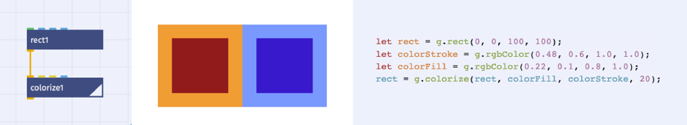
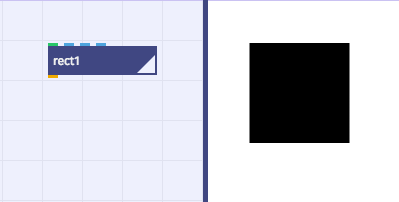
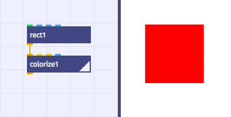
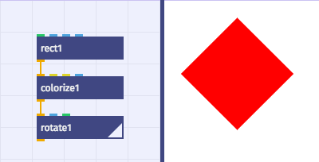
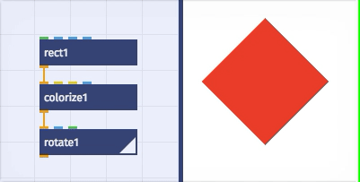
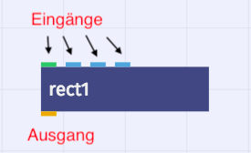
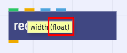

# Grundlagen

*Die grundlegenden Konzepte hinter [nodebox.live](http://nodebox.live)*

## Visuelle Programmierung

NodeBox ist ein Programm oder auch System zur visuellen Programmierung. D.h. Programme, also Abläufe, werden anhand visueller Elemente erstellt. Dies steht im Gegensatz zu text-basierter Programmierung, bei der Code, also Programmier-Text verfasst wird.

Im Beispiel oben sind die zwei Rechtecke in der Mitte einmal mittels visueller Programmierung (links zu sehen) und einmal mittels code-basierter Programmierung erstellt (rechts zu lesen).

Bei der visuellen Programmierung hat man eine gute Übersicht des Ablaufs: im ersten Knoten (`rect`) oben wird die Form erzeugt und dann zum Einfärben an den zweiten Knoten (`colorize`) unten weiter gegeben. Das Programm ist zugleich Bedienoberfläche (Interface), da man hier die Werte, bspw. Größe od. Farbe, direkt ändern kann. Allerdings sind diese Werte nicht auf den ersten Blick sichtbar. Will man einen bestimmten Knoten oder darin eingestellten Wert finden, so muss man sich erst orientieren und evtl. viele Knoten anklicken.

Bei der code-basierten Programmierung / Text-Programmierung sind hingegen alle Werte auf den ersten Blick ersichtlich. Dieser Vorteil ist zugrleich Nachteil, da gerade für Anfänger der viele strukturierte Text auf den ersten Blick undurchdringlich wirkt. Die Programmierung mittels Code erlaubt es allerdings viel komplexere Vorgänge sehr kompakt auszudrücken. Ähnlich der mathematischen Schreibweise ist auch die Syntax von modernen Programmiersprachen dafür ausgelegt abstrakte Vorgänge damit beschreiben zu können.

## Nodebox als Fließband

## Knoten

Wenn wir Knoten miteinander verbinden, entsteht eine Art Fließband bei der die Informationen an jeden einzenen Arbeiter (also Knoten) weitergeben werden um Formen zu erzeugen und zu verändern.

In NodeBox, wie in vielen anderen visuellen Programmierumgebungen auch, fließen die Daten also von einem „Knoten“ zum nächsten. Jeder Knoten verrichtet eine bestimmte Aufgabe (Knoten sind Funktionen) und gibt sein Ergebnis an den nächsten weiter.

### Beispiel:

1. Erstellen wir einen `rect` Knoten.

	

2. Verbinden wir einen `Colorize` Knoten mit dem `rect` Knoten. Er verändert den Output und färbt ihn ein.

  

3. Anschließend fügen wir einen `rotate` Knoten hinzu. Er nimmt den output und rotiert ihn.

   

Wir Können jeden einezelnen Schritt nachvolziehen indem wir mit einem Doppelklick den aktiven Knoten (Render-Knoten) wechseln: 
	

   
   
   [Beispiel](https://nodebox.live/nodebox-intro/b00knoten)

## Ein- und Ausgänge

- Jeder Knoten verarbeitet ein oder mehrere Eingaben (Inputs) um eine Ausgabe (Output) zu erzeugen.

  
  
- Alle Eingang-Ports in Nodebox erwarten Input eines bestimmten Typs. Jeder Ausgang-Port erzeugt einen Output eines bestimmten Typs.
- Wenn man über einem Eingang mit der Maus verweilt, sieht man welchen Datentypen der Knoten an diesem Port erwartet.
- Wenn man über dem Ausgang mit der Maus verweilt, sieht man welchen Datentyp der Output des Knotens hat.

  

## Datentypen

Die Datentypen an den Ports werden in der Regel durch Farben codiert:

### Zahlen

-  `Nummern` sind sowohl ganzzahlige Werte `integer` (zb. 1 / 5 / 72 usw.)   
als auch Zahlen mit Nachkommastellen `float` (z.B 0.25 / 1.678 / 3.333 usw.)

	- `float`werden benutzt um um z.B die breite/höhe eine Objekts zu verändern.
	- `integer` werden benutzt um Mengen anzugeben also z.B. 10 Kopien im `copy` Knoten

### Points

-  `Points` (Punkte) sind zweidimensionale Koordinaten die `X` und `Y` Koordinaten enthalten.
	- Sie können benutzt werden um ein Ort zu bestimmen z.B die Position eines Rechtecks, die Skalierung im `scale` Knoten oder den Dreh- und Angelpunkt eins `rotate` Knoten (also den Punkt um den rotiert werden soll)

### Shapes

-  `Shapes` (Formen) enthalten Informationen über Kurven, Linien und Punkte.

### Strings
-  `Strings` (Zeichenketten) enthalten reinen Text.
	- In der Regel der Text in dem `textpath` Knoten.

### Listen

-  `Listen` sind Sammlungen und können deshalb mehrere `Nummern` `Points`, `Shapes` und `Colors` Enthalten.
	- Deshalb können sie auch mit Eingängen verbunden werden, die einen anderen Typ erwarten. d.H so lange die Liste aus Zahlen besteht, kann sie auch mit dem  `Nummern` Eingang verbunden werden.

### Farben
-  `Colors` enthalten Farbwerte in der Form von red/green/blue/alpha (`rgbColor`) oder hue/saturation/brightness/alpha (`hsbColor`) werten.
	- Sie werden benutzt um Farbwerte zu definieren: z.B die Füllfarbe eines Objekts oder die Kontur einer Linie.

---

Weiter zu [01 – Interface](01-interface.md) oder zur [Übersicht](readme.md)
