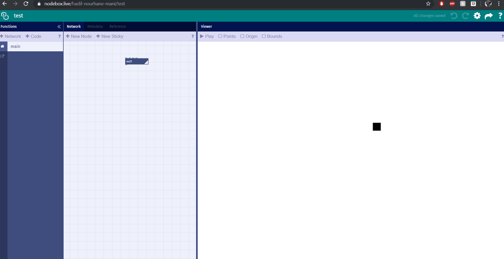
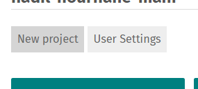
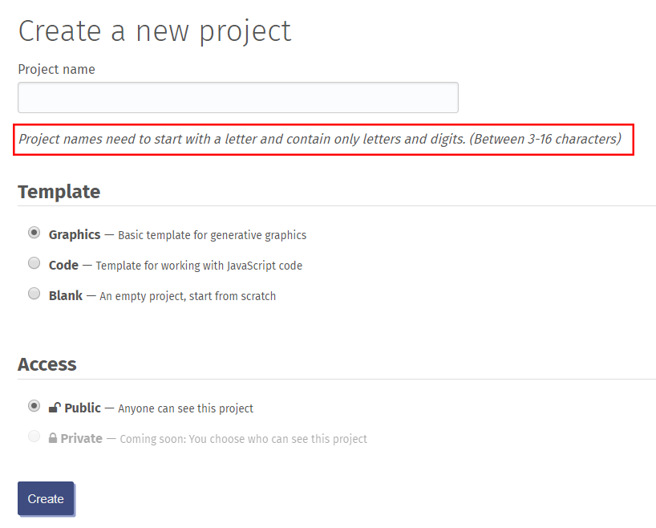
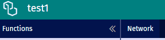
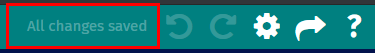

# Interface

*Arbeiten mit Nodebox.live*

- Screenshot

## Gotchas

Vorsicht:   
Nodebox.live ist Alpha-Software (experimentell)

- Chrome Only!
- Scroll vs Pinch 
	- zum Zoomen der Arbeitsfläch niemals Pinch oder Zoom-Einstellungen des Browsers benutzen. Das heißt, die Tastenkombination `CTRL + +/-` oder `CMD + +/-` können nicht Zoomen verwendet werden.
	
	
	
	- Auch das Touchpad wird sich als nutzlos erweisen.
	
	
	
	- Auf OSX `CMD + 0` in Windows `CTRL + 0` um die Zoom-Stufe des Browsers auf 100% zu setzen. Ebenfalls kann die Maus genutzt werden um rein oder raus zu zoomen.
	
	
	
	
- Immer einloggen!
	- Sonst geht das Programm verloren
	- [Login-Seite](https://nodebox.live/login)
- Programme regelmässig sichern!

## Neues Programm erstellen 

- Programm ID

	
	
	
	
- Programm Name und Farbe können direkt im Programm selbst beim Einstellungssymbol nach Wünsch verändert werden.

	

- Das Programm sicher von selbst solange man mit dem Internet verbunden ist. Dies lässt sich immer an der Anzeige kontrollieren.

	

## Programm sichern & wiederherstellen

- JSON-Quellcode
- Quellcode runterladen (aktuelle Version sichern)
	- mit dem Browser
- Quellcode hochladen (alte Version wiederherstellen)
	- mit dem Brower

## Programme klauen

- Nur für Fortgeschrittene ;-)
	- Quellcode kopieren
	- Suchen + Ersetzen des Programm-Namens

