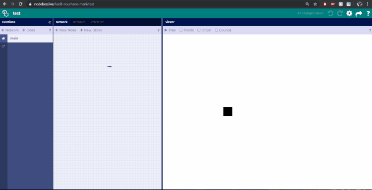
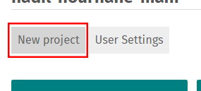

# Interface

*Arbeiten mit [nodebox.live](http://nodebox.live)*

## Browser und Systemvoraussetzungen

Aktuell unterstützt nodebox.live vor allem den Chrome Browser in der neuesten Version.

Gerade bei komplexen Projekten kann es dazu kommen, dass der Browser den Computer sehr fordert. Sollte euer Projekt also unglaublich langsam werden … dann probiert mal einen schnelleren Rechner aus.

## Anmeldung und so

[nodebox.live](http://nodebox.live) ist noch in einer frühen Phase (sog. Alphasoftware) und daher nicht fertig und eher experimentell. Im Kommunikationsdesign an der Hochschule Mainz nutzen wir es etwa seit 2017. Bisher war die Registrierung nicht freigeschaltet und nur mit einem äußerst geheimen Code möglich. Seit kurzem scheint aber eine [freie Registrierung](https://nodebox.live/users/create) möglich geworden zu sein.

Nach der Registrierung und Anmeldung kommt man auf die Projekte-Übersicht zum eigenen Konto. Hier sind alle Projekte alphabetisch aufgelistet, d.h. man kann die Reihenfolge über die Wahl des Names bestimmen.

Wichtig ist zu wissen, dass in NodeBox.live nichts privat und lediglich versteckt ist. Kennt man den Benutzernamen einer anderen Person, so kann man sich dessen Projekte anschauen und sogar „klauen“ … oder wie wir lieber sagen „forken“ (abzweigen).

Ein paar Beispiele:
- [Frederik de Bleser](https://nodebox.live/fdb), Autor von NodeBox
- [Martin Schneider](https://nodebox.live/bitcraftlab), ehem. Leiter des iLab, heute HfG Schwäbisch Gmünd
- [Prof. Florian Jenett](https://nodebox.live/fjenett)
- [Das offizielle Tutorial Konto](https://nodebox.live/tutorial)
- [Unsere eigene Referenz](https://nodebox.live/reference)

## Projekt-Fenster

Von der Projekte-Liste aus gelangt man zum Projekt-Fenster.

 
 
 Dieses Bedienfenster eines geöffneten Projekts hat im Grunde 5 Bereiche.
 
 1) Den Titel-Balken (hier dunkelgrün) mit dem Namen des Projekts und einem Link zur Projekte-Übersicht (das Logo links) dem Mitteilungsfeld in der Mitte und einem Menu rechts mit globalen Funktionen wie Undo / Redo, Projekt-Einstellungen, Projekt-Export und Hilfe.
 
 2) Darunter Links befindet sich die Funktions-Liste (`Functions`). Funktionen sind im Grunde Unter-Projekte oder -Bereiche des geöffneten Projekts. Man kann hier eigene Knoten anlegen, die dann einen modularen Programmaufbau ermöglichen.
 
 3) Rechts daneben ist das Fenster mit dem Programm-Ablauf (`Network`) zum in der Funktions-Liste gewählten Unterbereich. Dies ist der Hauptarbeitsbereich, in dem man seine Programme erstellt.
 
 4) Neben dem Programm-Ablauf sieht man das Ausgabe-Fenster (`Viewer`). Hier wird das Ergebnis eures Programmes „gerendert“, d.h. in das Fenster gemalt, oder hier ausgegeben (falls es Text o.Ä. ist).
 
 5) Ganz rechts ist die Hilfe (`Guide`) zu sehen. Diese lässt sich wie eine kleine Webseite navigieren. Zudem kann man die Hilfe aus den Knoten heraus mit der entsprechenden Hilfeseite zum Knoten öffnen lassen. Die Hilfe ist allerdings nicht immer hilfreich … da sie momentan noch die code-basierte Bibliothek namens [g.js](http://g.js.org/), die hinter NodeBox steht, behandelt.
 
## Verschieben der Ansichten

Sowohl die Ansicht des Programm-Ablaufs, als auch die Ausgabe können mit der Mouse verschoben werden. Dazu klick man einfach in einen freien Bereich und zieht in eine Richtung als würde man eine Karte verschieben.

Den Programm-Ablauf (`Network`) kann man zurück an seinen Ursprung verschieben, indem man eine freie Stelle rechts-klickt und dann im Menu „Reset View“ (ansicht zurücksetzen) wählt.

Die Ansicht der Ausgabe kann durch doppel-klicken an ihren Ursprung zurück gesetzt werden.
  
## Zoomen / Vergrößern

Zum Zoomen der Arbeitsfläche oder Ausgabe sollte man nicht die Möglichkeiten des Browsers nutzen. D.h. die Tastenkombinationen `CTRL` - `+/-` oder `CMD` - `+/-` sollten nicht verwendet werden, da sie vor allem die Texteinstellungen der gesamten Seite und damit das ganze Interface verändern. Die Zoom-Stufe des Browsers lässt sich mit den Tastenkombinationen `CMD` - `0` (Mac) oder `CTRL` - `0` (Windows) auf 100% zurücksetzen.
	

	

	
Durch die Scroll-Bewegung kann mit dem Touchpad (MacBook, etc.) heran und heraus gezoomt werden. Genauso mit dem Scroll-Rad der Maus.
	

	
## Sichern

NodeBox sichert automatisch die aktuellen Änderungen solange man online ist. Dies lässt sich immer an der Anzeige kontrollieren.


Damit das klappt, muß man immer eingeloggt sein. Macht man eine Änderung in einem fremden Konto, oder ohne eingeloggt zu sein, so erscheint oben eine rote Fehlermeldung. Aus unserer Erfahrung übersieht man diese leider manchmal.

Man kann Programme als Text-Dateien exportiern, die sich später wieder laden lassen. Dies ist weiter unten auf dieser Seite erklärt. Aktuell ist dies die einzige Möglichkeit um Projekte nochmals lokal zu speichern und man sollte dies bei wichtigen Projekten regelmäßig machen.

## Neues Programm / Projekt erstellen

[Neue Programme](https://nodebox.live/projects/create) lassen sich auf der Programm-Listen-Seite erstellen.


	
Da Programme in NodeBox selbst als Funktionen eingesetzt werden, muss ihre ID bestimmten Vorgaben folgen: sie sollte min. 3 Zeichen, maximal 16 Zeichen haben, muß mit einem Buchstaben beginnen und darf nur Buchstaben (a-z, A-Z, keine Umlaute und Sonderzeichen) und Zahlen beinhalten.
	


Oft verwendet man den sog. „Camel-Case“ (Kamelschreibweise) um Wörter im Namen zu trennen: derSchnelleVogel.
	
Den Programm-Namen und die Farbe (für die Liste und die Titelzeile im Programm-Bereich) kann man im Programm-Bereich durch Klick auf den Titel oder das Einstellungs-Symbol (Zahnrad) rechts ändern.


## Programm als Text sichern & wiederherstellen

Man kann Programme als JSON-Texte speichern und diese später auch wieder laden. Dies ist eher ein Hack, als eine wirkliches Feature von NodeBox.live. Es wurde auf unseren Wunsch geöffnet, damit wir unsere Projekte noch mal lokal sichern und vor allem untereinander austauschen können.

Das Vorgehen ist wie folgt:

- Öffnet den Programm-Bereich eines Projekts
- An die URL (Internetadresse) des Programms hängt ihr `?raw` dran, bspw:
```
https://nodebox.live/nodebox-intro/a02compound
wird zu
https://nodebox.live/nodebox-intro/a02compound?raw
```
- Öffnet diese Adresse (drückt Enter)
- Auf der nun sichtbaren Seite gibt es ein Textfeld, in dem der JSON-Code eures Programms enthalten ist


- Diesen Code kann man per Copy-Paste in eine `.json` Datei speichern und später aus dieser wieder in das Textfeld kopieren
- Habt ihr eine Veränderung am Code vorgenommen, so könnt ihr diese durch drücken des Knopfes darunter speichern. Natürlich nur bei euren eigenen Projekten

## Programme übernehmen

Dies geht im Grunde wie oben beschrieben, nur daß man den JSON-Code eines fremden Projekts kopiert und in ein eigenes Projekt einfügt. Zu beachten ist dabei nur, dass man die ID des fremden Projekts durch die des eigenen ersetzt. Das kann man gut mit einem Editor wie bspw. [„Atom“](https://atom.io/) machen. Die IDs findet man in der URL / Adresse, oder im JSON-Code:

```
"id": "a02compound"
```


In Schritten:
- Raw-Seite des fremden Projekts öffnen (siehe oben)
- JSON-Code kopieren
- in einem Text-Editor per Suchen-Finden die ID des fremden Projekts durch die des eigenen ersetzen
- Raw-Seite des eigenen Projekts öffnen
- JSON-Code einfügen
- speichern und dann die Projekt-Seite öffnen (`?raw` aus der URL entfernen)

---

Weiter zu [02 - Grafik](02-grafik.md) oder zur [Übersicht](readme.md)
