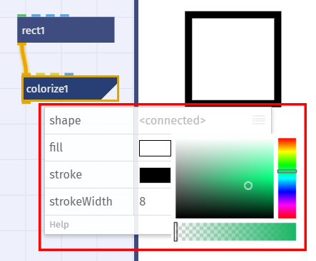
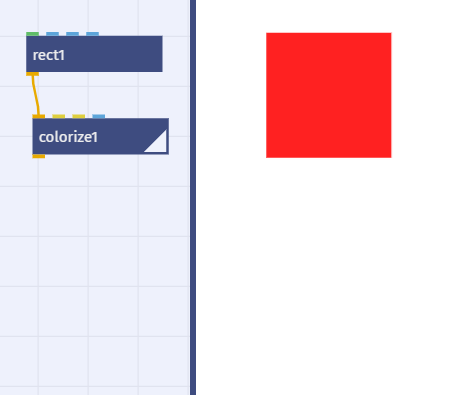
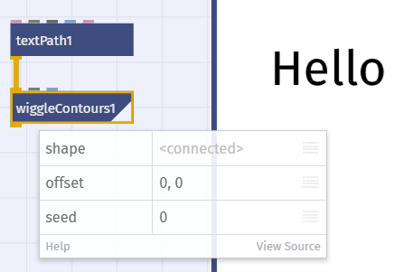
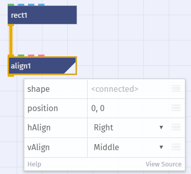
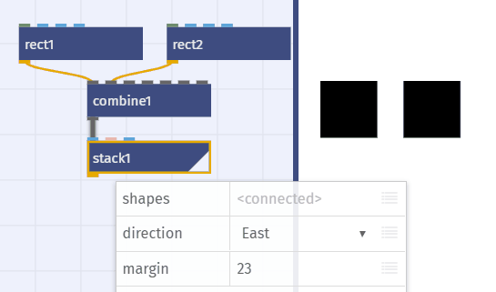
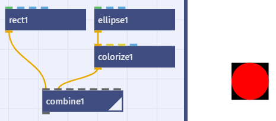
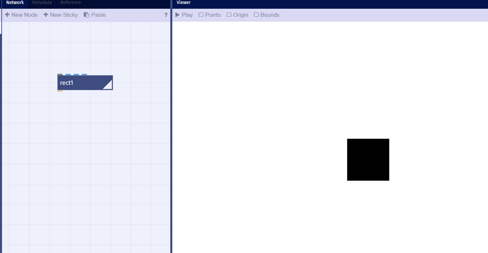
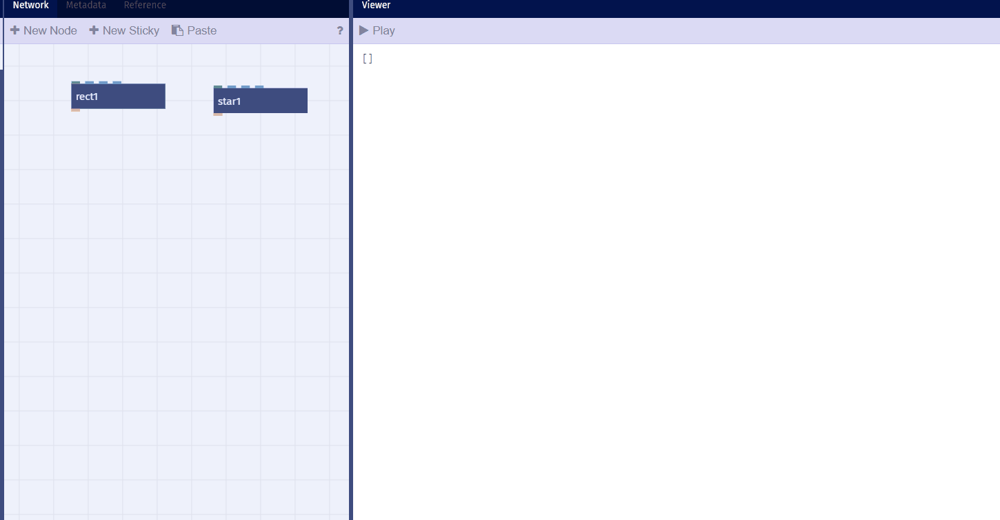

# Grafik

## Grundformen

### Dreieck, Quadrat, Kreis

 Dreieck, oder allgemein Vieleck: `polygon`

Quadrat, oder allgemein Rechteck: `rect`

Durch die Einstellung `roundness` lässt sich aus dem Rechteck auch eine Ellipse oder ein Kreis formen, wenn man das mal braucht.

	
Kreis, oder allgemein Ellipse: `ellipse`
	

	
Stern: `star`
	
Verändert man die Einstellungen des Knoten so lässte sich auch ein Dreieck formen.

## Shapes

Formen, die man mit den zuvor aufgelisteten Funktionen erstellt werden zu sog. Shapes. Dadurch erben sie bestimmte Eigenschaften und Methoden (Dinge, die sie tun können).

Ein Shape hat (Auszug):
- eine Füllfarbe (`fill`) 
- eine Umrißfarbe (`stroke`)
- eine Strichstärke (`strokeWidth`)
- …

	
- Diese Eigenschaften kann man mit dem `colorize`-Knoten ändern.

Ein Shape kann (Auszug):
- sich rotieren (`rotate()`)
- sich als SVG exportieren (`toSVG()`)
- seine Umrissbox (Bounding Box) berechnen (`bounds()`)
- …

## Pfade

Eine Shape beinhaltet einen Pfad, das ist ein abstraktes Objekt, das die geometrischen Daten der Form vorhält.

Ein Pfad setzt sich zusammen aus:
- Grade Strecken, also Linien
- Bezier-Kurven
- Kreis-Segementen
- Sprünge (Linien, die nicht gezeichnet werden, um von einer zur nächsten Form zu gelangen, bspw. zwischen zwei Buchstaben)

## Kontouren

Ein Pfad kann aus einer oder mehreren Konturen bestehen.

Beispiel: `textPath`erzeugt eine Shape mit Innen- und Außenkonturen. Mit `wiggleContour` kann man die Kontouren durcheinander würfeln.

- Es gibt *Außenkontouren* und *Innen-Kontouren*
  (Beispiel: Buchstabe 'O')
- Eine Kontour kann offen sein (Pfad mit Anfang und Ende) oder geschlossen so dass die letzte Strecke am Ende wieder mit dem ersten Punkt des Pfads verbunden ist.

## Gruppen

Mehrere Shapes kann man mit `group` zu einer Gruppe zusammen fassen. [Beispiel](https://nodebox.live/nodebox-intro/b02group)

## Anordnen

### Layout
- Einpassen in einen Bereich: `fit`
- Einpassen in Objekte: `fitTo`
- Ausrichten: `align`

- Stapeln: `stack` [Beispiel](https://nodebox.live/nodebox-intro/b02stack)

]
	
### Listen
- Liste von Objekten mit `combine` erstellen  [Beispiel](https://nodebox.live/nodebox-intro/b02combine)

- Die Objekte werden in der Reihenfolge gemalt in der sie in der Liste stehen
- Neu sortiern mit `shapeSort`
	
### Gruppieren:
- `group`und `ungroup`
- Gruppe filtern: `deletePaths`

- Gruppen werden als ein Objekt behandelt
- Beispiel `fit` mit Liste vs Gruppe

## Flächen verschmelzen

- Jeder Pfad ist bereits eine Fläche / Flächenumriss
- Pfade verbinden / einfärben mit `colorize`
- Boolsche Flächen-Operationen:`compound` [Beispiel](https://nodebox.live/nodebox-intro/b02compund)
	- Zwei Flächen verschmelzen
	- Flächen ausschneiden
	- Mehrere Flächen verschmelzen
	
	
	
- Morphen zwischen Flächen

---

Weiter zur [03 - Bewegung](03-bewegung.md) oder zur [Übersicht](readme.md)
	

	
