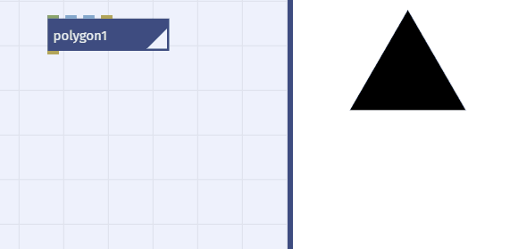
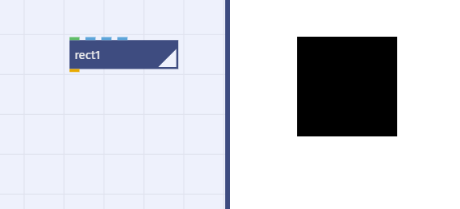
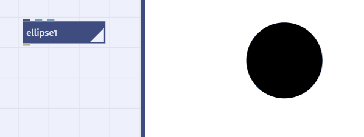
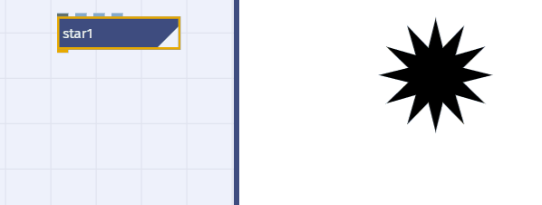

# Grafik

## Grundformen

- Dreieck, Quadrat, Kreis:
	- Dreieck, oder allgemein Vieleck: `polygon`
	
	
	
	- Quadrat, oder allgemein Rechteck: `rect`
	
	
	
	- Kreis, oder allgemein Ellipse: `ellipse`
	
	
	
	- Stern: `star`
	
	

## Shapes

- Ein Shape hat:
	- eine Füllfarbe (`fill`) 
	- eine Umrißfarbe (`stroke`)
	- eine Strichstärke (`strokeWidth`)
- Diese Eigenschaften kann man mit dem `colorize`-Knoten ändern.

## Pfade

- Eine Shape ohne Füllung (mit transparenter Füllung) ist ein Pfad.
- Ein Pfad setzt sich zusammen aus:
	- Grade Strecken
	- Bezier-Kurven
	- Kreis-Segemente
	- Sprünge

## Kontouren

- Ein Pfad kann aus ein oder mehreren Konturen bestehen
	- Beispiel: `textPath`erzeugt eine Shape mit Innen und Außenkonturen. 
	- Mit `wiggleContour` kann man die Kontouren durcheinanderschütteln
	
	
- Es gibt *Außenkontouren* und *Innen-Kontouren*
  (Beispiel: Buchstabe 'O')
- Eine Kontour kann offen sein (Pfad mit Anfang und Ende) oder Geschlossen (Outline einer Shape)

## Gruppen

- Mehrere Shapes kann man mit `group` zu einer Gruppe zusammengefassen.

## Anordnen

- Layout
	- Einpassen in einen Bereich: `fit`
	- Einpassen in Objekte: `fitTo`
	- Ausrichten: `align`
	- Stapeln: `stack`
- Listen
	- Liste von Objekten mit `combine` erstellen
	- Die Objekte werden in der Reihenfolge gemalt in der sie in der Liste stehen
	- Neu sortiern mit `shapeSort`
- Gruppieren:
	- `group`und `ungroup`
	- Gruppe filtern: `deletePaths`
	- Gruppen werden als ein Objekt behandelt
	- Beispiel `fit` mit Liste vs Gruppe

## Flächen verschmelzen

- Jeder Pfad ist bereits eine Fläche / Flächenumriss
- Pfade verbinden / einfärben mit `colorize`
- Boolsche Flächen-Operationen:`compound`
	- Zwei Flächen verschmelzen
	- Flächen ausschneiden
	- Mehrere Flächen verschmelzen
- Morphen zwischen Flächen

	

	
