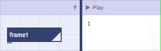
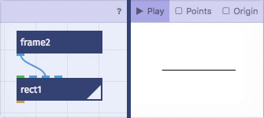
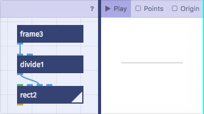
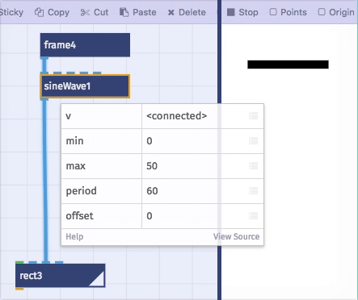
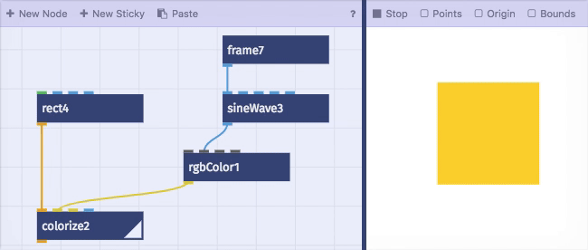

# Bewegung

*Animationen fürs Web und Animierte Gifs mit Nodebox.live*

- [Animations Knoten](#animations-knoten)
- [Wellenfunktionen](#wellenfunktionen)
- Beispiele:
  - [Farben Animieren]()
  - Listen Animieren

## So geht's

- Screenshot Interface
- Animation abspielen
- Export als animiertes GIF

## Animations-Knoten

Der `frame` Knoten kann benutzt werden um nahezu alle Parameter in Nodebox zu animieren. Wenn wir auf den `play` Knopf drücken erhalten wir einfach den aktuellen Frame als Zahl:

 

 Verbinden wir diese Zahl z.B. mit dem `width` Eingang eines `rect` Knotens wächst dieser in die Unendlichkeit:

 Um die Geschwindigkeit und den Verlauf der Animation zu bestimmen, können wir die Zahl aus dem `frame` Knoten mit anderen Funktionen manipulieren. Oft benutzen wir dazu `multiply`, `divide`, `mod`, `convert` und die Wellenfunktionen.

 - Wenn wir z.B. die Zahl aus dem `frame` Knoten erst mit dem `divide` Knoten durch drei Teilen, ist unsere Animation nur noch ein drittel so schnell wie oben:

 

 - der `mod` Knoten dividiert eine Zahl durch eine andere, aber nur der "Rest" bleibt als Ergebnis:
    - 4 : 5 = 0 und Rest ist 4 ==> also ist 4 das Ergebnis
    - 5 : 5 = 1 und Rest ist 0
    - 6 : 5 = 1 und Rest ist 1

    >ist mod als Konzept nützlich?
    >oder doch lieber die Sägezahn Funktion benutzen?

  - Frame-basiert vs. Echtzeit
    - Aktueller Frame: `frame`
    - Sekunden seit Start:`eleapsedSeconds`

#### Wellenfunktionen:
  - Der `sineWave` Knoten erzeugt eine Sinus Welle und ermöglicht uns so wiederholende und "weiche" Animationen. Die Animation fängt langsam an wird schneller und bremst gegen Ende wieder ab. In AfterEffects lässt sich über `Easy-Ease` ein ähnlicher Effekt erreichen.

Eingänge | Erklärung
------------ | -------------
v | hier kommt unser `frame` als Eingang
min | der niedrigste Wert den wir als Ausgang benötigen
max | der höchste Wert
period | die Anzahl an Frames bis sich die Animation wiederholen soll
offset | Hier können wir den den Startpunkt verschieben (in diesem Fall nicht notwendig).

  - Dreieck
  - Sägezahn
  - Rechteck

## Beispiele

### Farben Animieren

- erstelle einen `rect` Knoten und verbinde den Ausgang mit einem `colorize`Knoten.
- Unser zentrales Element für die animation der Farbe ist der `rgbColor` Knoten:
  - dazu Verbinden wir einen `frame`Knoten mit einem `sineWave` Knoten.
  - Der `sineWave` Knoten muss den `min` Wert von "0" und den `max` Wert von "1" haben. In dem Beispiel ist der `period` Wert auf "60" damit wiederholt sich die Animation nach 60 Frames. Ein wert von 120 würde z.B unsere Animation nur halb so schnell abspielen lassen.
  - Verbinde nun den `sineWave` Knoten mit dem `green` Eingang des `rgbColor` Knotens.
- Wenn du nun den `rgbColor` Knoten mit dem `fill` Eingang des `colorize` Knoten verbindes:
- Yaay unser Rechteck wechselt nun die Farbe 👏

- TODO: link zu beispiel

> Natürlich kann statt dem `rect` Knoten auch alle anderen
> Formen oder Gruppen von Formen eingefärbt werden.

### Listen Animieren

## Gotchas

- Viele Knoten (z.B. `pointOnPath` oder `hslColor`) erwarten als Eingang Zahlen zwischen 0 und 1. Die Werte müssen also  mit den Wellenfunktionen oder `mod` verkleinert werden.
- Für zyklische GIFs muss die Phase muss ein Teiler der Framezahl sein.
- bei 100 Frames z.B. 50, 33, 25, 20, 10 oder 5.
