# Import-Export, Sharing

Ein Werkzeug für die Gestaltung ist natürlich nur so gut, wie es sich in Gestaltungsprozesse integrieren lässt. NodeBox.live ist zwar eine „Web-Anwendung“, läuft also als Webseite im Internet, kann aber dennoch Dateien laden und speichern. Genauer gesagt importieren und exportieren.

Ein weiterer Bereich ist das „Sharing“, also die Möglichkeit NodeBox Projekte mit anderen zu teilen. Dies ist ein Feature, das sich primär in online Tools findet und auch NB bietet dies an.

## Import ⇄ Export

Die wichtigsten **Eingangs-Formate** für NodeBox sind:

- SVG, „scaleable vector graphics“, das sind Dateien, die Pfadinformationen enthalten und für den Austausch mit Verktor-Software wie Illustrator oder InkScape geeignet sind.

- CSV

- Bilder im JPG und PNG Format

- Fonts (??)

**Ausgeben** kann man Grafiken aus NodeBox in den Formaten:

- SVG, s.o.

- GIF

- Bilder und Videos ... dazu kann man einfach einen Screenshot / -Recording machen 😉
  
  - Auf dem Mac geht das sehr einfach mit QuickTime, auf dem PC kann man leicht eine Software dafür finden, bspw. Camtasia, etc.

### SVGs, Fonts und Grafiken importieren

Der wichtigste Knoten für den Import von Materialien nach NodeBox ist `import` ([Beispiel]([NodeBox Live](https://nodebox.live/reference/importRef))). Beim Import sind allerdings einige Aspekte zu beachten.

1) Importierte Dateien liegen bei NodeBox auf einem öffentlich zugänglichen Server, sie sind also von jedermann aufrufbar und können auch herunter geladen werden. Private Dateien und sensible Daten sollte man so also nicht einsetzen.

2) Da die Daten für jedermann zugänglich sind, gilt hier auch besondere Vorsicht bei der Verwendung von Material aus fremden Quellen. Die Verwendung gilt als Veröffentlichung und damit muss man Urheberrechte, Copyright, etc. beachten.

3) NodeBox rechnet Bilder und andere Materialien nicht um, d.h. man muss diese schon möglichst für ihren Einsatz optimiert hochladen.
   (→ hier fehlt ein Link zu den Hinweisen dazu)

## SVGs aus Illustrator

### vor dem Export:

- Um zu vermeiden, dass irgentwelche unerwünschten Pfade im svg landen, starten wir zuerst mit einer neuen Datei. Dabei ist zu achten, dass die Datei in Pixeln und im RGB Modus ist:
  
    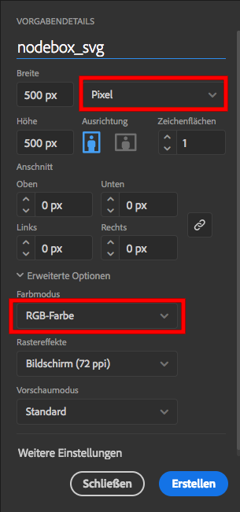

- Nodebox kann nicht mit außergwählich großen Dateien umgehen. Am einfachsten können wir deswegen unsere Zeichnung mit `Objekt > Pfad > vereinfachen…` reduzieren.
  
    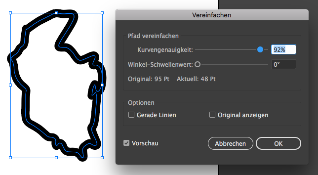

- ...
  
    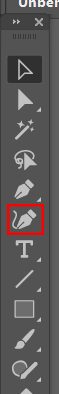
    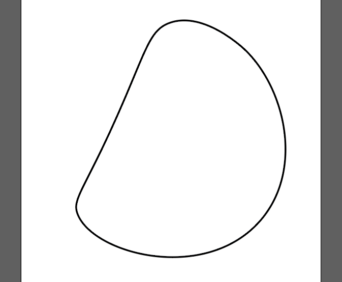
    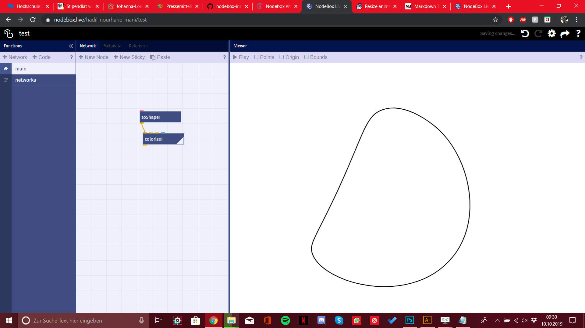  

- ...
  
    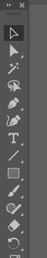 
    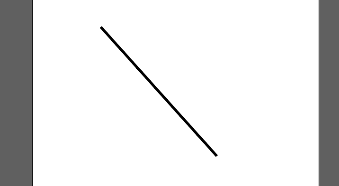  
    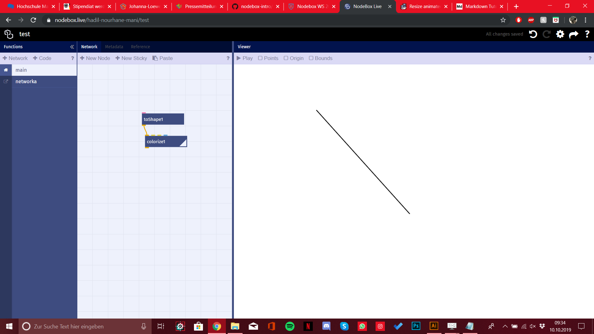  

- ...
  
    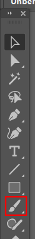
    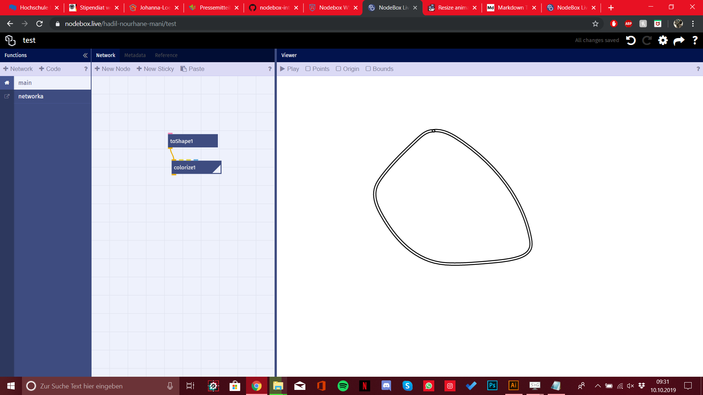
    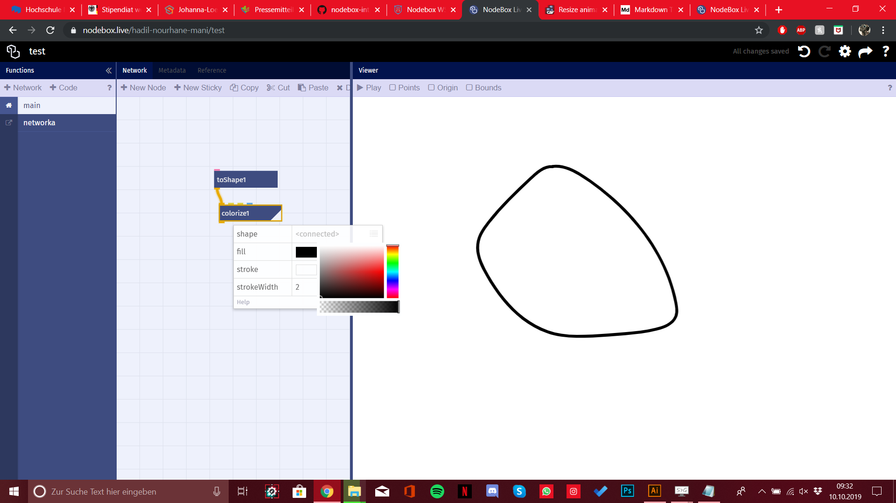  

- ...
  
    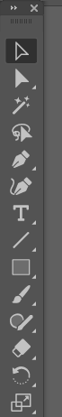
    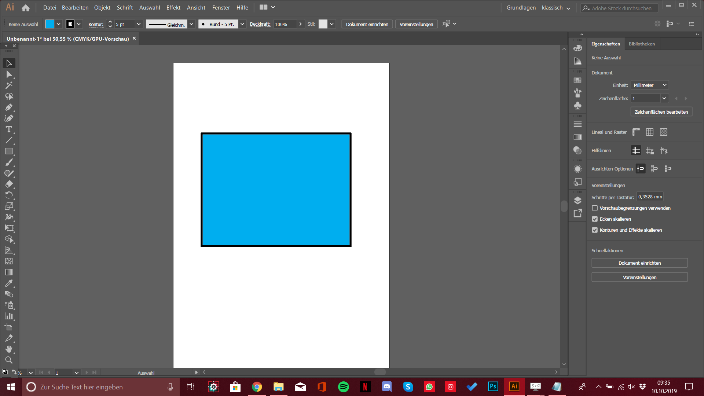
    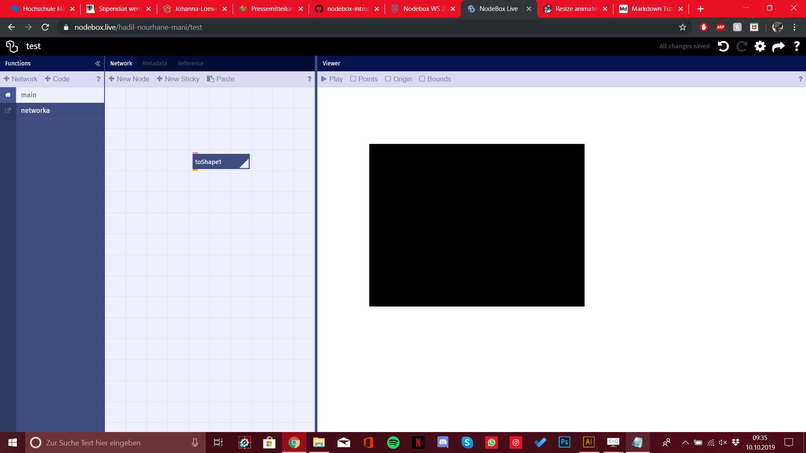  

- ...
  
    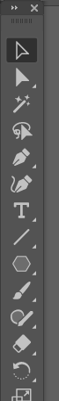
    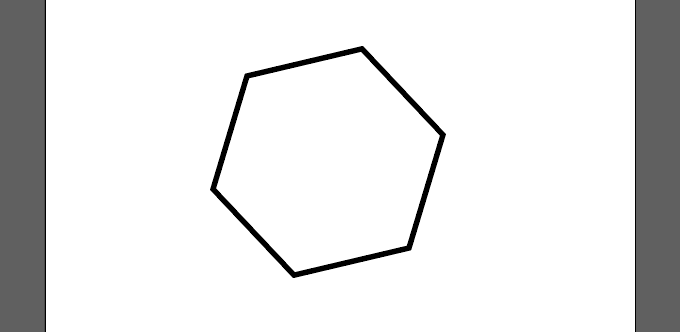
    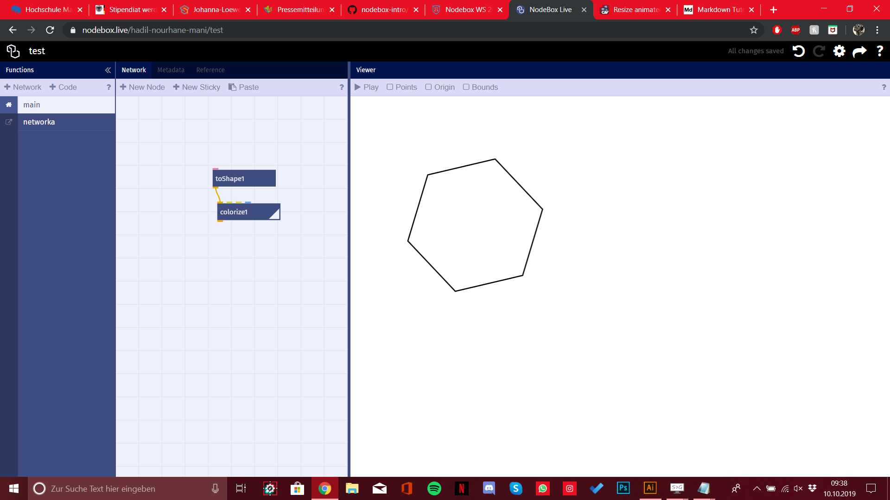 

- ...
  
    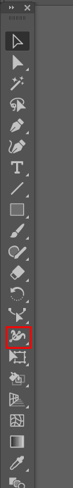
    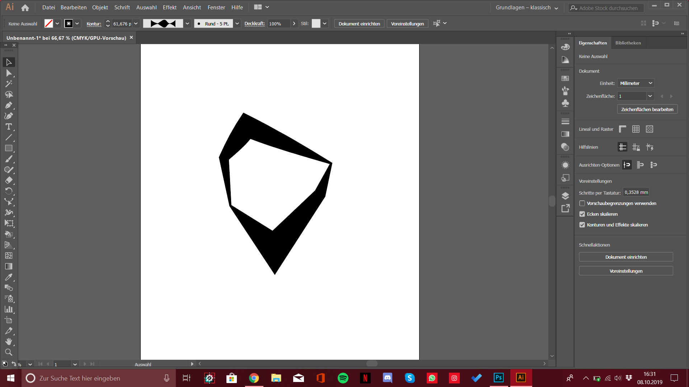  

- ...
  
    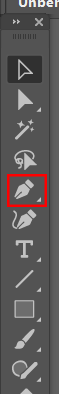
    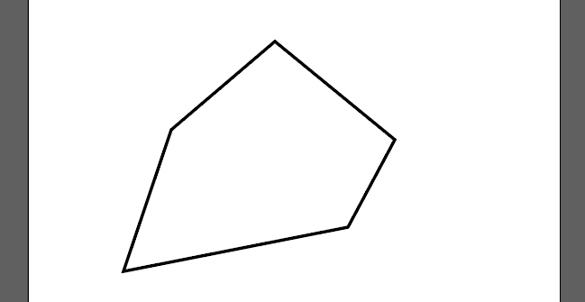
    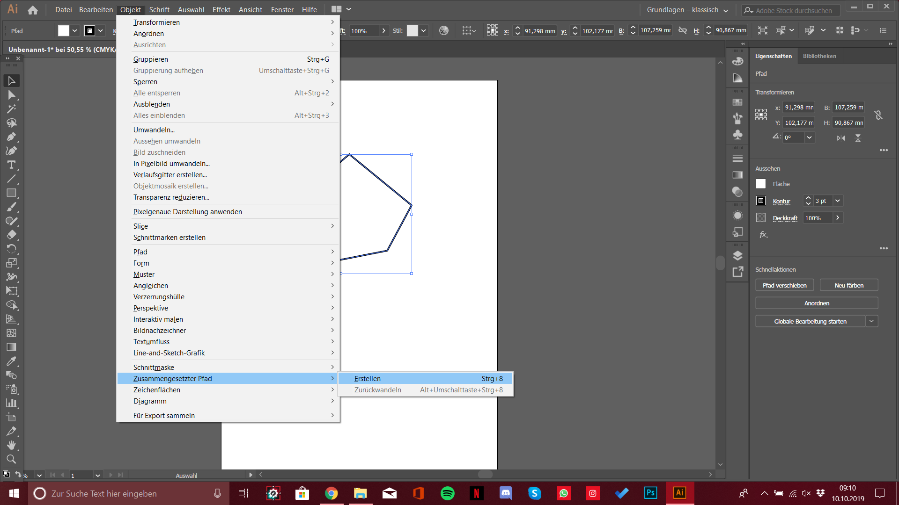
    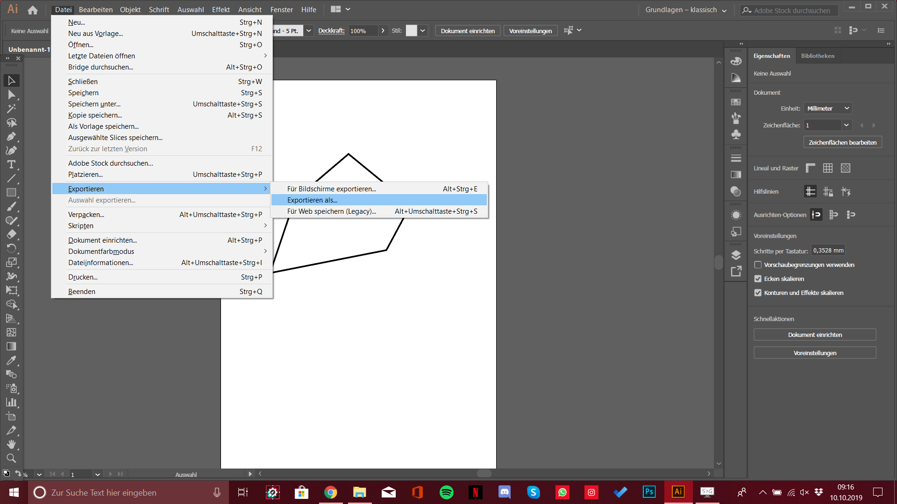
    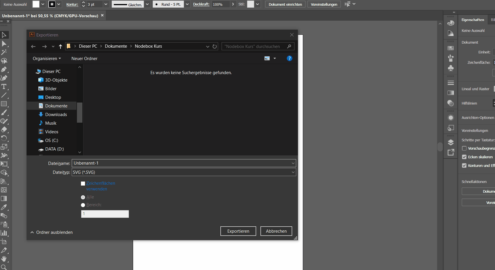

### Import

- ...
  
    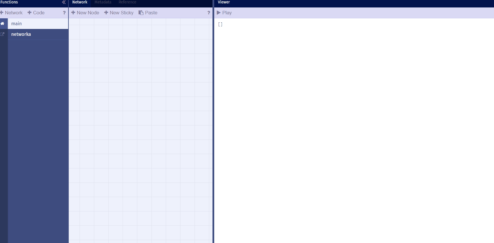

### Export

- `Datei > Speicher unter…` um SVGs zu exportieren

- Im nächsten Fenster bei Format `SVG (svg)` auswählen. Und __kein__ Haken bei "Zeichenflächen benutzen" setzen

- Im Nächsten Fenster ist besonder `SVG 1.0` wichtig. Eventuell müssen auch die anderen Einstellungen angepasst werden.
  
    

- Wir gross ist das File?

- ggf. [Pfade in Illustrator vereinfachen](#vor-dem-export)

- Gotchas
  - SVG-Probleme mit Nodebox
  - Filesize Limit
  - Lösungs-Ansätze
    - SVG-Cleaner Software?
    - Shapes etwas drehen

# Assets aus dem Netz laden

- Etwa für Live-Datenvisualisierung
- Mit Javascript möglich
- Siehe auch `net` library

## Animierte Gifs exportieren

- Frames
- Größe
- Weiterverarbeiten
- Verbreiten und teilen

## SVGs exportieren

- Screenshot

## Fonts exportieren

- Theoretisch möglich dank opentype.js
- Coming soon ...

---

Weiter zur [05 - Punkt und Linie](05-punkt-und-linie.md) oder zur [Übersicht](readme.md)
