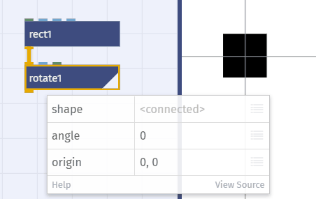
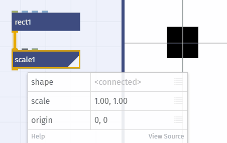

# Verwandlung

*Transformation von Objekten*

## Flächen verwandeln
	
- _Affine_ Transformationen
	- verschieben: `translate`
	
	
	
	- drehen: `rotate`
	
	
	
	- spiegeln: `flip`
	
	
	
	- dehnen: `scale`
	
	
	
	- kippen: `skew`
	
	

## Eigene Transformationen

- Grafiken-Transformation durch Punkt-Transformation
- Flächen → Pfade → Punkte → X und Y →  *Transformation* →  X und Y → Punkte → Pfade → Flächen 

	  

	- Pfade → Punkte: `toPoints` 
	
	
	
	- Punkte → X und Y : `lookup`
	- Transformation : Mathematische Funktionen, Javascript etc.
	- X und Y → Punkte: `makePoint`
	
	
	
	- Punkte → Pfade: `connectPoints`
	
	
	
	- Pfade → Fläche: `colorize` 
	
	

## 2D-Transformation
	
- Warping mit Funktionen: Beispiel
- warp library: Beispiel
	
## 3D-Transformation

- Kippen mit `skew`: Beispiel
- Isometrische Geometrie simulieren: Beispiel

---

Weiter zur [07 – Chaos und Zufall](07-chaos-zufall.md) oder zur [Übersicht](readme.md)
