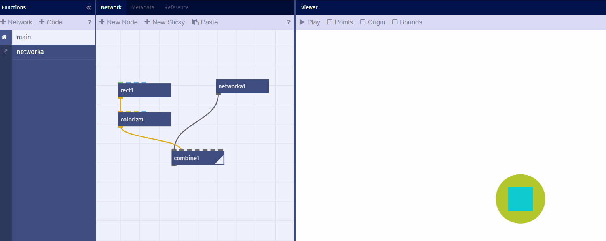
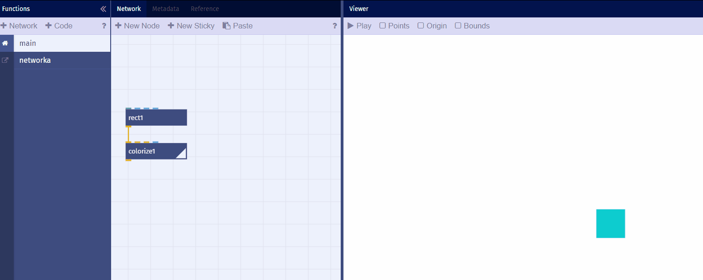

# Eigene Nodes

*Eigene Nodes programmieren in Nodebox.live*

## Network Nodes

- Eignene Nodes
	- Nodes erstellen und löschen
	
	
	
	

	
	- Nodes können nicht umbenannt werden

## Nodes mit Parametern

- Ports automatisch erstellen
- Ports manuell erstellen
	- Datentypen
	- Default-Werte
	- Listen-Verarbeitung
	
	

  

  

# Javascript Nodes

- Beispiele
	- Hello World
	- einfacher Wrapper für g.js Funktionen
	- API-Beispiel
- Javascript 
	- Javascript Intro
	- [g.js](http://gjs.org/) API
	- g.js source code (github)
