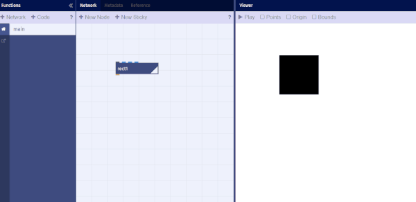
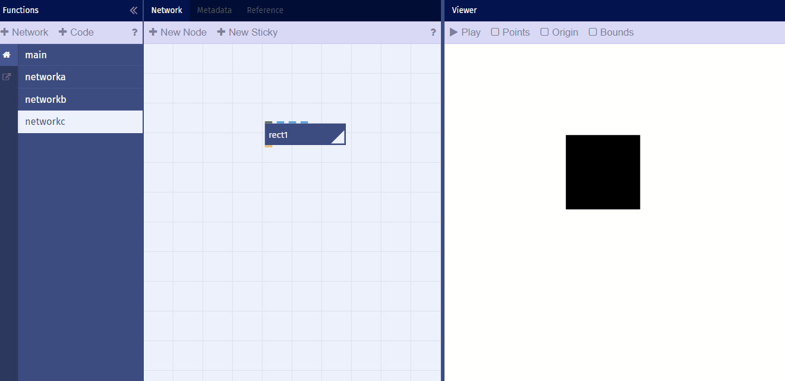
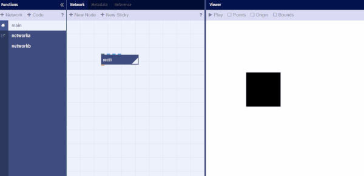
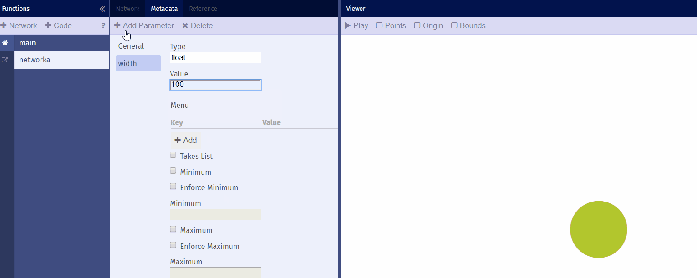
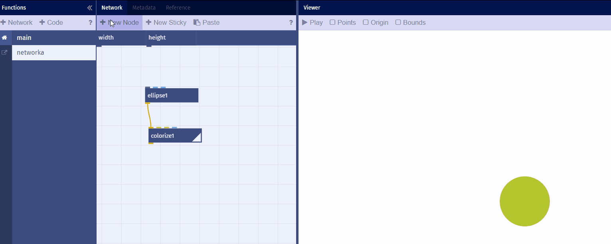
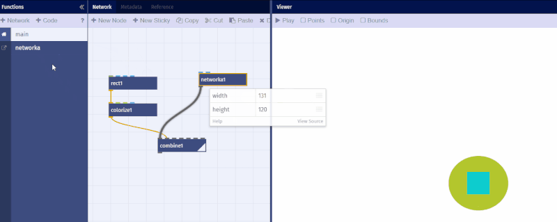
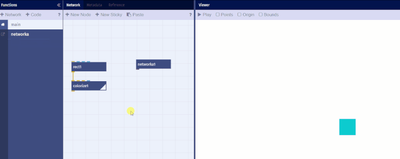
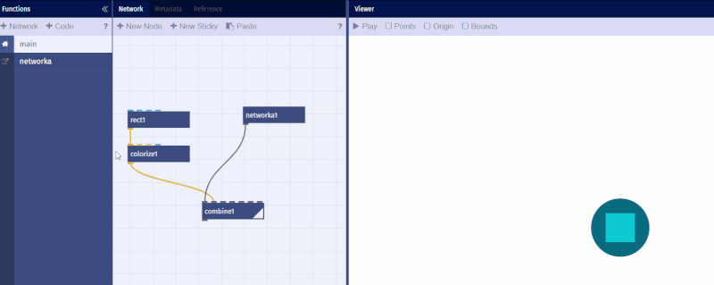
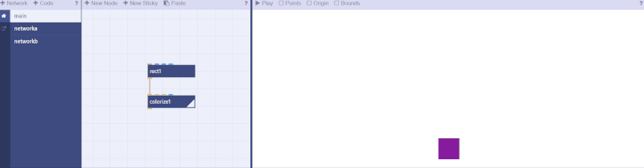
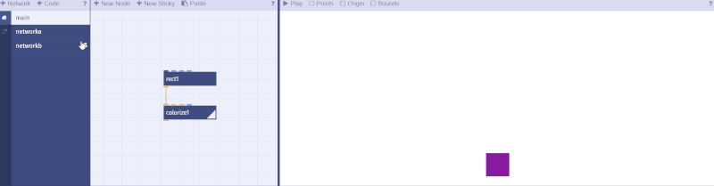

# Eigene Nodes

*Eigene Nodes programmieren in Nodebox.live*

## Network Nodes

- Eignene Nodes
	- Nodes erstellen und löschen
	
	  
	  
	
	Das Network kann jedoch nicht mehr umbenannt werden. Es ist aber möglich das Network zu löschen.
	
	  
	
	Nun sind Unterprogramme erstellt worden, die nicht miteinander verbunden sind.

## Nodes mit Parametern

- Ports automatisch erstellen
- Ports manuell erstellen
	Datentypen
	Default-Werte
	Listen-Verarbeitung  
	
	  
	Durch die Funktion Metadaten können wir Parameter erstellen, die bestimmte Werte rausgeben. In diesem Fall werden die Werte zu width, Breite, und height, Höhe, weitergeleitet.  
	
	  
	Hier gitb man für den value-Wert 100 ein.  
	
	  
	Die Ports, die sich dann ergeben, werden mit den Eingangsports des Shape-Knotens verbunden. Es muss darauf geachtet werden, dass die Eingangsports des Knoten verwendet werden. In diesem Fall die Ports für width and height.  
	
	  
	Nun kann das Unterprogramm, in diesem Fall networka, in das main-Programm als Knoten eingefügt werden und es lassen sich die Werte zur Breite und Höhe verändern. Ebenfalls ist zu sehen, dass der networka-Knoten nun width und height Inputports besitzt. Enfernt man jedoch die Paramter im networka-Unterprogramm so verschwinden auch diese Inputports beim networka-Knoten im main-Programm.

  
Wenn man ein Unterporgramm erstellte, ist man in der Lage dieses als Knoten in das main-Programm reinzuziehen.  

  
Durch den combine-Knoten lassen sich die Darstellungen des main-Programms und des Unterprogramms gleichzeitig zeigen.

  
Sollte man nun an dem Unterprogramm etwas verändern, wie zum Beispiel die Farbe verändern, so zeigt sich dies auch im main-Programmm.  

  
Durch das Pinnen, also die Verwendung der Nadel-Funktion, ist man in der Lage die Darstellung eines Programmes, ob nun Unterprogramm oder main-Programm, in den anderen Programm-Arbeitsflächen zu sehen.   
    

# Javascript Nodes

- Beispiele
	- Hello World
	- einfacher Wrapper für g.js Funktionen
	- API-Beispiel
- Javascript 
	- Javascript Intro
	- [g.js](http://gjs.org/) API
	- g.js source code (github)

---

Weiter zur [09 – Gitter und Raster](09-gitter-und-raster.md) oder zur [Übersicht](readme.md)
