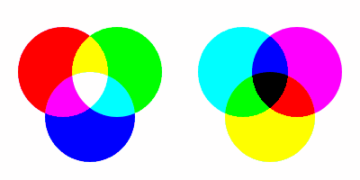
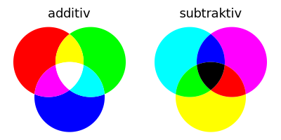

# Color Library

Library zum Mischen von Farben

## Beispiele

###  [colorPlay01](https://nodebox.live/bitcraftlab/colorPlay01) — Farben Mischen (Pixelgrafik)

  

###  [colorPlay02](https://nodebox.live/bitcraftlab/colorPlay02) — Farben Mischen (Vektor-Grafik)

  

## Nodes

### getFill

Füllfarbe einer Form extrahieren

### blendColor

Zwei Farben mischen

- `color1` — erste Farbe
- `color2` — zweite Farbe
- `mode` — BlendMode  
	- `screen` (additiv)
	- `multiply` (subtraktiv)
	- ...

### intersect

Zwei Geometrien schneiden, so dass drei Teil-Flächen entstehen.  
Die Schnittfläche wird entsprechend der Mischfarbe eingefärbt.

- `shape1` — erste Geometrie
- `shape2` — zweite Geometrie
- `mode` — BlendMode für Farbmischung

### intersectThree

Drei Geometrien schneiden, so dass sieben Teil-Flächen entstehen.
Die Schnittflächen werden entsprechend der Mischfarben eingefärbt

- `shape1` — erste Geometrie
- `shape2` — zweite Geometrie
- `shape3` — dritte Geometrie
- `mode` — BlendMode für Farbmischung

