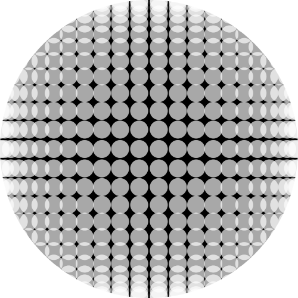
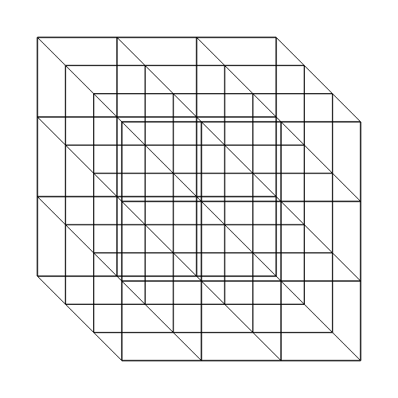

# Combinatoric Library

Library zum kombinieren von Daten.

## Beispiele

###  [combionatoric Test](https://nodebox.live/bitcraftlab/combinatoricTest) — Erstellen von Grids (2D)

1. Sampling-Punkte auf dem Kreisumfang bestimmen
2. Das kartesische Produkt der X und Y Koordianten der Sampling-Punkte ergibt ein Gitter für die Rasterpunkte

  

###  [combionatoric Test](https://nodebox.live/bitcraftlab/colorPlay02) — Erstellen von Grids (3D)

  

1. Die 4 x 4 x 4 Punkte des Raumgitters ergeben sich aus der dritten Potenz der Liste `[ 0, 100, 200, 300 ]`
2. Die Kordinaten werden in 3D-Punkte mit (x,y,z) Koordinaten verwandelt
3. Isometrische Projektion der Punkte
4. Verbinden der benachbarten Punkte durch Linien

## Nodes

### product

Kombinatorisches (Kartesis Produkt aus mehreren Listen.  
Dabei wird jedes Element der ersten Liste mit jedem Element der zweiten kombiniert, usw.  
Auf diese Weise lassen sich z.B. Gitterpunkte erzeugen.

- `list1` — erste Liste
- `list2` — zweite Liste
- `list3` — dritte Liste
-  ...

## Links
- [Kartesisches Produkt](https://de.wikibooks.org/wiki/Mathe_f%C3%BCr_Nicht-Freaks:_Kartesisches_Produkt) (Mathe für Nicht-Freaks)
- [Outer](https://reference.wolfram.com/language/ref/Outer.html)(Mathematica)
- [Cartesian Product in Javascript](https://stackoverflow.com/questions/12303989/cartesian-product-of-multiple-arrays-in-javascript) (Stackoverflow)
- [Cross](https://observablehq.com/@d3/d3-cross) (d3.js) 
