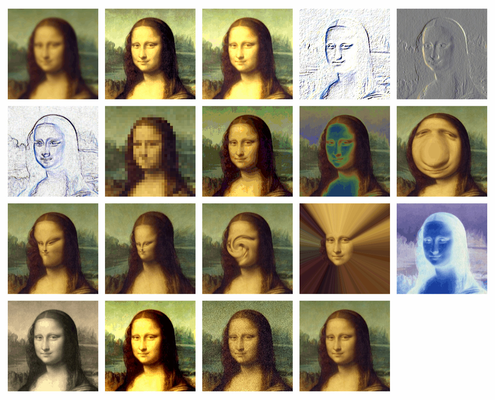

# Image Library

Library zum Bearbeiten von Pixelgrafiken.

## Beispiele

- [Image Examples 01](https://nodebox.live/bitcraftlab/imageExample01)

### *image filters* — Pixel-Grafik filtern

Übersicht über alle Image-Filter der Library

- `blur` — Unschärfe
- `equalize` — automatischer Farbabgleich
- `glow` — Überstrahlen
- `crossEdge` — Diagonaler Kanten-Filter
- `emboss` — Relief-Filter
- `findEdges` — Kanten-Filter
- `mosaic` — Mosaik-Effekt 
- `posterize`— Farb-Reduktion
- `solarize` — Farbverschiebung (Solarisations-Effekt)
- `bump` —  Verzerren: Aufblasen
- `dent` —  Verzereen: Zusammenziehen
- `pinch` — Verzerren: Zusammenziehen II
- `twirl` — Verzerren: Spiralförmig
- `lightTunnel` — Licht-Tunnel-Effekt
- `invert`— Farb-Inversion (Foto-Negativ)
- `sepia` — Einfärben ("altes Foto-Papier")
- `brighten` —  Helligkeit und Kontrast
- `addNoise` — Bildrauschen hinzufügen

### generating images — Pixel-Grafik erzeugen

- `colorImage`- einfarbige Grafik
- `gradientImage` - Farbübergang als Grafik
- `import` - importieren von Pixel-Grafik
