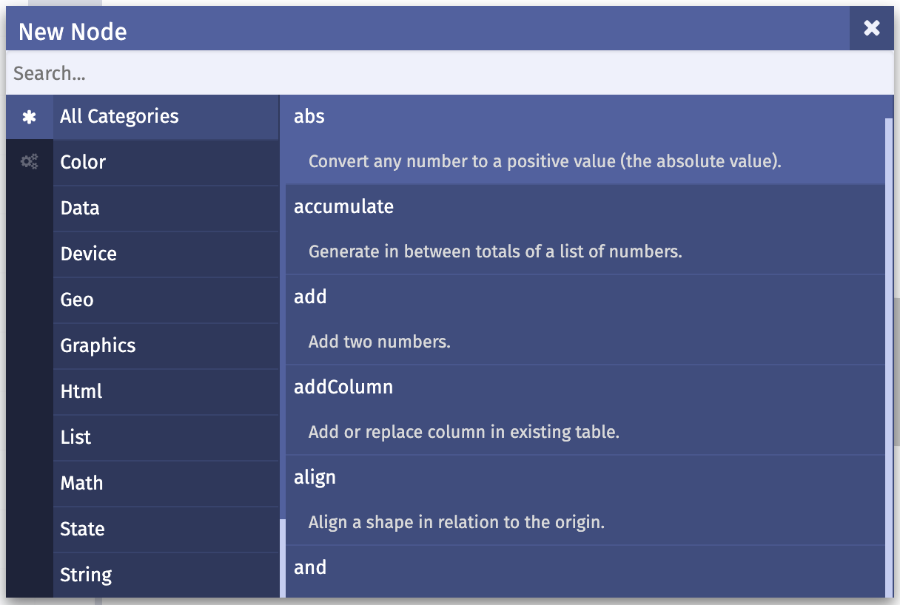

# Übersicht aller Knoten (Nodes)

In nodebox.live sind die Knoten thematisch gegliedert. Die Liste aller Knoten öffnet sich, wenn man in die Arbeitsfläche doppel-klickt, oder oben links darüber auf den Link „+ New Node“ klickt, oder mit Rechtsklick das Maus-Kontext-Menu öffnet und dort „New Node“ auswählt.

Die Kategorien sind:

| *Inhalt* | *Name* | *Beschreibung* |
| ------ | ------ | ------ |
| [Farbe](#farbe--color) | Color | Herstellen, Verändern, Anwenden von Farbe auf Shapes (Formen) |
| [Daten](#daten--data) | Data | Laden, Aufarbeiten, Konvertieren, Filtern von Daten |
| [Geräte](#geräte--device) | Device | Die Mouse auslesen |
| [Geografie](#geografie--geo) | Geo | Verarbeitung von geografischen Daten |
| [Grafisches](#grafisches--graphics) | Graphics | Herstellen, Verändern, Ausrichten von Formen (Shapes) |
| [HTML](#html) | Html | Schnittstelle zu HTML und dem DOM des Browsers |
| [Listen](#listen--list) | List | Arbeit mit Listen (Arrays) von Werten |
| [Mathematik](#mathematik--math) | Math | Mathematische Methoden und Generatoren von Werten |
| [Zustand](#zustand--state) | State | Speichern und Laden von Zuständen |
| [Text](#text--string) | String | Erstellen, Veränderung von Texten |
| [Zeit](#zeit--time) | Time | Auslesen von Zeit und zeitliche Funktionen (Easings) |
| [Sonstiges](#sonstiges--uncategorized) | Uncategorized | ... |

Nachfolgend sind die Knoten der Kategorien aufgelistet und kurz beschrieben.

## Farbe / Color

| Name | Beschreibung | Referenz | Beispiel |
| --- | --- | --- | --- |
 | `colorize` | Färbt Formen / Shapes ein. | [Referenz](https://github.com/nodebox/g.js/blob/gh-pages/ref/colorize.md) | [Beispiel](https://nodebox.live/reference/colorize) | 
 | `grayColor` | Mischt ein Grau. | [Referenz](https://github.com/nodebox/g.js/blob/gh-pages/ref/grayColor.md) | [Beispiel](https://nodebox.live/reference/grayColor) | 
 | `hexColor` | Erstellt aus einem hexadezimalen Wert (bspw. #9922EE) eine Farbe. | [Referenz](https://github.com/nodebox/g.js/blob/gh-pages/ref/hexColor.md) | [Beispiel](https://nodebox.live/reference/hexColor) | 
 | `hslAdjust` | Verändert Farbton, Sättigung und Helligkeit der Farbe einer Form / Shapes. | [Referenz](https://github.com/nodebox/g.js/blob/gh-pages/ref/hslAdjust.md) | [Beispiel](https://nodebox.live/reference/hslAdjust) | 
 | `hslColor` | Mischt eine Farbe aus den Werten von Farbton, Sättigung und Helligkeit (HSL-Modus). | [Referenz](https://github.com/nodebox/g.js/blob/gh-pages/ref/hslColor.md) | [Beispiel](https://nodebox.live/reference/hslColor) | 
 | `invert` | Invertiert eine Farbe. | [Referenz](https://github.com/nodebox/g.js/blob/gh-pages/ref/invert.md) | [Beispiel](https://nodebox.live/reference/invert) | 
 | `parseColor` | Wandelt einen Farbnamen oder hexadezimalen Code in eine Farbe um. | [Referenz](https://github.com/nodebox/g.js/blob/gh-pages/ref/parseColor.md) | [Beispiel](https://nodebox.live/reference/parseColor) | 
 | `rgbAdjust` | Verändert Rot, Grün, Blau und Alpha-Werte der Farbe einer Form. | [Referenz](https://github.com/nodebox/g.js/blob/gh-pages/ref/rgbAdjust.md) | [Beispiel](https://nodebox.live/reference/rgbAdjust) | 
 | `rgbColor` | Mischt eine Farbe aus Rot, Grün und Blau (RGB-Modus). | [Referenz](https://github.com/nodebox/g.js/blob/gh-pages/ref/rgbColor.md) | [Beispiel](https://nodebox.live/reference/rgbColor) | 

## Daten / Data

| Name | Beschreibung | Referenz | Beispiel |
| --- | --- | --- | --- |
 | `addColumn` | Fügt eine Spalte hinzu oder ersetzt eine Spalte in einer Tabelle. | [Referenz](https://github.com/nodebox/g.js/blob/gh-pages/ref/addColumn.md) | [Beispiel](https://nodebox.live/reference/addColumn) | 
 | `convert` | Konvertiert Werte von einem Werte-Bereich in einen anderen. | [Referenz](https://github.com/nodebox/g.js/blob/gh-pages/ref/convert.md) | [Beispiel](https://nodebox.live/reference/convert) | 
 | `fetchJSON` | Führt eine HTTP-GET-Anfrage durch und gibt JSON-Daten zurück. | [Referenz](https://github.com/nodebox/g.js/blob/gh-pages/ref/fetchJSON.md) | [Beispiel](https://nodebox.live/reference/fetchJSON) | 
 | `filterData` | Filtert Daten, indem jeder Eintrag mit einem gegebenen Wert verglichen wird. | [Referenz](https://github.com/nodebox/g.js/blob/gh-pages/ref/filterData.md) | [Beispiel](https://nodebox.live/reference/filterData) | 
 | `groupBy` | Gruppiert Daten nach Schlüssel/Wert. | [Referenz](https://github.com/nodebox/g.js/blob/gh-pages/ref/groupBy.md) | [Beispiel](https://nodebox.live/reference/groupBy) | 
 | `import` | Importieren Daten (CSV, SVG) aus einer Datei. | [Referenz](https://github.com/nodebox/g.js/blob/gh-pages/ref/import.md) | [Beispiel](https://nodebox.live/reference/importRef) | 
 | `keys` | Gibt die Schlüssel einer Tabelle zurück. | [Referenz](https://github.com/nodebox/g.js/blob/gh-pages/ref/keys.md) | [Beispiel](https://nodebox.live/reference/keys) | 
 | `lookup` | Ließt einen bestimmten Wert anhand eines Schlüssels aus einer Tabelle oder aus einem Objekt aus. | [Referenz](https://github.com/nodebox/g.js/blob/gh-pages/ref/lookup.md) | [Beispiel](https://nodebox.live/reference/lookup) | 
 | `zipMap` | Kombiniert eine Liste von Schlüsseln mit einer Liste von Werten zu einer Map (Liste von Schlüssel/Wert Paaren). | [Referenz](https://github.com/nodebox/g.js/blob/gh-pages/ref/zipMap.md) | [Beispiel](https://nodebox.live/reference/zipMap) | 

## Geräte / Device

| Name | Beschreibung | Referenz | Beispiel |
| --- | --- | --- | --- |
 | `mousePosition` | Gibt die aktuelle Mausposition zurück. | [Referenz](https://github.com/nodebox/g.js/blob/gh-pages/ref/mousePosition.md) | [Beispiel](https://nodebox.live/reference/mousePosition) | 

## Geografie / Geo

| Name | Beschreibung | Referenz | Beispiel |
| --- | --- | --- | --- |
 | `geoProject` | Konvertiert ein Länge-/Breitengrad-Paar zu X-/Y-Koordinaten. | [Referenz](https://github.com/nodebox/g.js/blob/gh-pages/ref/geoProject.md) | [Beispiel](https://nodebox.live/reference/geoProject) | 

## Grafisches / Graphics

| Name | Beschreibung | Referenz | Beispiel |
| --- | --- | --- | --- |
 | `align` | Richtet eine Form/Shape an einem Ursprung (X-/Y-Koordinate) aus. | [Referenz](https://github.com/nodebox/g.js/blob/gh-pages/ref/align.md) | [Beispiel](https://nodebox.live/reference/align) | 
 | `arc` | Erstellt einen Bogen, Torte oder eine Keilform. | [Referenz](https://github.com/nodebox/g.js/blob/gh-pages/ref/arc.md) | [Beispiel](https://nodebox.live/reference/arc) | 
 | `bounds` | Gibt ein Rechteck (Bounding Box) zurück, das die gegebene Form/Shape umschließt. | [Referenz](https://github.com/nodebox/g.js/blob/gh-pages/ref/bounds.md) | [Beispiel](https://nodebox.live/reference/bounds) | 
 | `centerPoint` | Berechnet den geometrischen Mittelpunkt einer Form/Shape. | [Referenz](https://github.com/nodebox/g.js/blob/gh-pages/ref/centerPoint.md) | [Beispiel](https://nodebox.live/reference/centerPoint) | 
 | `compound` | Addiert, subtrahiert oder schneidet Geometrien. Wie das "Pathfinder"-Werkzeug in Illustrator. | [Referenz](https://github.com/nodebox/g.js/blob/gh-pages/ref/compound.md) | [Beispiel](https://nodebox.live/reference/compound) | 
 | `connectPoints` | Verbindet Punkte zu einem Pfad. | [Referenz](https://github.com/nodebox/g.js/blob/gh-pages/ref/connectPoints.md) | [Beispiel](https://nodebox.live/reference/connectPoints) | 
 | `coordinates` | Berechnet einen Punkt basierend auf gegebenem Winkel zu und dem Abstand von einem Ursprungspunkt. | [Referenz](https://github.com/nodebox/g.js/blob/gh-pages/ref/coordinates.md) | [Beispiel](https://nodebox.live/reference/coordinates) | 
 | `copy` | Erstellt mehrere Kopien einer Form. Das Original kann beim Kopieren zusätzlich rotiert, skaliert und verschoben werden. | [Referenz](https://github.com/nodebox/g.js/blob/gh-pages/ref/copy.md) | [Beispiel](https://nodebox.live/reference/copy) | 
 | `curve` | Erstellt eine (quadratische) Kurve anhand eines Anfangs-, Kontroll- und Endpunkts. | [Referenz](https://github.com/nodebox/g.js/blob/gh-pages/ref/curve.md) | [Beispiel](https://nodebox.live/reference/curve) | 
 | `deletePaths` | Löscht Linien (Pfade) anhand eines Begrenzungspfads. | [Referenz](https://github.com/nodebox/g.js/blob/gh-pages/ref/deletePaths.md) | [Beispiel](https://nodebox.live/reference/deletePaths) | 
 | `deletePoints` | Löscht Punkte anhand eines Begrenzungspfads. | [Referenz](https://github.com/nodebox/g.js/blob/gh-pages/ref/deletePoints.md) | [Beispiel](https://nodebox.live/reference/deletePoints) | 
 | `desaturate` | Desaturiert die Farbe einer Form. | [Referenz](https://github.com/nodebox/g.js/blob/gh-pages/ref/desaturate.md) | [Beispiel](https://nodebox.live/reference/desaturate) | 
 | `distance` | Berechnet die Entfernung zwischen zwei Punkten. | [Referenz](https://github.com/nodebox/g.js/blob/gh-pages/ref/distance.md) | [Beispiel](https://nodebox.live/reference/distance) | 
 | `ellipse` | Erstellt eine Ellipse oder einen Kreis. | [Referenz](https://github.com/nodebox/g.js/blob/gh-pages/ref/ellipse.md) | [Beispiel](https://nodebox.live/reference/ellipse) | 
 | `fit` | Passt eine Form/Shape in die gegebene Fläche (Rechteck) ein. | [Referenz](https://github.com/nodebox/g.js/blob/gh-pages/ref/fit.md) | [Beispiel](https://nodebox.live/reference/fit) | 
 | `fitTo` | Passt eine Form/Shape in eine zweite Form/Shape ein. | [Referenz](https://github.com/nodebox/g.js/blob/gh-pages/ref/fitTo.md) | [Beispiel](https://nodebox.live/reference/fitTo) | 
 | `flip` | Spiegelt eine Form oder ein Bild. | [Referenz](https://github.com/nodebox/g.js/blob/gh-pages/ref/flip.md) | [Beispiel](https://nodebox.live/reference/flip) | 
 | `grid` | Erstellt ein Raster von Punkten. | [Referenz](https://github.com/nodebox/g.js/blob/gh-pages/ref/grid.md) | [Beispiel](https://nodebox.live/reference/grid) | 
 | `group` | Gruppiert mehrere Formen. | [Referenz](https://github.com/nodebox/g.js/blob/gh-pages/ref/group.md) | [Beispiel](https://nodebox.live/reference/group) | 
 | `line` | Verbindet zwei Punkte zu einer Linie. | [Referenz](https://github.com/nodebox/g.js/blob/gh-pages/ref/line.md) | [Beispiel](https://nodebox.live/reference/line) | 
 | `lineAngle` | Erstellt eine Linie von einem Punkt ausgehend anhand des gegebenen Winkels und Abstands. | [Referenz](https://github.com/nodebox/g.js/blob/gh-pages/ref/lineAngle.md) | [Beispiel](https://nodebox.live/reference/lineAngle) | 
 | `link` | Generiert eine Verbindung zwischen zwei Formen. | [Referenz](https://github.com/nodebox/g.js/blob/gh-pages/ref/link.md) | [Beispiel](https://nodebox.live/reference/link) | 
 | `makePoint` | Erstellt einen Punkt anhand der gebenen X- / Y-Koordinaten. | [Referenz](https://github.com/nodebox/g.js/blob/gh-pages/ref/makePoint.md) | [Beispiel](https://nodebox.live/reference/makePoint) | 
 | `mirror` | Spiegelt eine Form an einer gegebenen Achse. | [Referenz](https://github.com/nodebox/g.js/blob/gh-pages/ref/mirror.md) | [Beispiel](https://nodebox.live/reference/mirror) | 
 | `pathLength` | Errechnet die Konturlänge des Pfades. | [Referenz](https://github.com/nodebox/g.js/blob/gh-pages/ref/pathLength.md) | [Beispiel](https://nodebox.live/reference/pathLength) | 
 | `perlinNoise` | Berechnet die Perlin-Noise-Funktion. | [Referenz](https://github.com/nodebox/g.js/blob/gh-pages/ref/perlinNoise.md) | [Beispiel](https://nodebox.live/reference/perlinNoise) | 
 | `pointOnPath` | Berechnet einen Punkt auf einem gegebenen Pfad. | [Referenz](https://github.com/nodebox/g.js/blob/gh-pages/ref/pointOnPath.md) | [Beispiel](https://nodebox.live/reference/pointOnPath) | 
 | `polygon` | Erstellt ein mehrseitiges Polygon. | [Referenz](https://github.com/nodebox/g.js/blob/gh-pages/ref/polygon.md) | [Beispiel](https://nodebox.live/reference/polygon) | 
 | `quad` | Erstellt ein Viereck/Quad anhand der gegebenen Punkte. | [Referenz](https://github.com/nodebox/g.js/blob/gh-pages/ref/quad.md) | [Beispiel](https://nodebox.live/reference/quad) | 
 | `rect` | Erstellt ein Rechteck oder Quadrat. | [Referenz](https://github.com/nodebox/g.js/blob/gh-pages/ref/rect.md) | [Beispiel](https://nodebox.live/reference/rect) | 
 | `resampleByAmount` | Bricht einen Pfad in eine bestimmte Anzahl von Punkten auf. | [Referenz](https://github.com/nodebox/g.js/blob/gh-pages/ref/resampleByAmount.md) | [Beispiel](https://nodebox.live/reference/resampleByAmount) | 
 | `resampleByLength` | Bricht einen Pfad in gleichlange Segmente auf. | [Referenz](https://github.com/nodebox/g.js/blob/gh-pages/ref/resampleByLength.md) | [Beispiel](https://nodebox.live/reference/resampleByLength) | 
 | `rotate` | Rotiert eine Form/Shape um einen gegebenen Winkel. | [Referenz](https://github.com/nodebox/g.js/blob/gh-pages/ref/rotate.md) | [Beispiel](https://nodebox.live/reference/rotate) | 
 | `roundedSegments` | Rundet gerade Segmente einer Form/Shape ab. | [Referenz](https://github.com/nodebox/g.js/blob/gh-pages/ref/roundedSegments.md) | [Beispiel](https://nodebox.live/reference/roundedSegments) | 
 | `scale` | Skaliert eine Form/Shape | [Referenz](https://github.com/nodebox/g.js/blob/gh-pages/ref/scale.md) | [Beispiel](https://nodebox.live/reference/scale) | 
 | `scatterPoints` | Generiert zufällige Punkte innerhalb der Grenzen einer Form. | [Referenz](https://github.com/nodebox/g.js/blob/gh-pages/ref/scatterPoints.md) | [Beispiel](https://nodebox.live/reference/scatterPoints) | 
 | `shapeSort` | Sortiert Punkte oder Formen nach verschiedenen Sortierverfahren. | [Referenz](https://github.com/nodebox/g.js/blob/gh-pages/ref/shapeSort.md) | [Beispiel](https://nodebox.live/reference/shapeSort) | 
 | `skew` | Verzerrt eine Form/Shape anhand eines gegebenen Winkels. | [Referenz](https://github.com/nodebox/g.js/blob/gh-pages/ref/skew.md) | [Beispiel](https://nodebox.live/reference/skew) | 
 | `snap` | Richtet die Geometrie (Punkte) einer Form an einem Raster aus. | [Referenz](https://github.com/nodebox/g.js/blob/gh-pages/ref/snap.md) | [Beispiel](https://nodebox.live/reference/snap) | 
 | `stack` | Richtet Formen horizontal oder vertikal zueinander aus. | [Referenz](https://github.com/nodebox/g.js/blob/gh-pages/ref/stack.md) | [Beispiel](https://nodebox.live/reference/stack) | 
 | `star` | Erstellt eine Sternform. | [Referenz](https://github.com/nodebox/g.js/blob/gh-pages/ref/star.md) | [Beispiel](https://nodebox.live/reference/star) | 
 | `textPath` | Wandelt einen Text in Pfade um. | [Referenz](https://github.com/nodebox/g.js/blob/gh-pages/ref/textPath.md) | [Beispiel](https://nodebox.live/reference/textPath) | 
 | `toPoints` | Wandelt eine Form (Pfad) in Punkte um. | [Referenz](https://github.com/nodebox/g.js/blob/gh-pages/ref/toPoints.md) | [Beispiel](https://nodebox.live/reference/toPoints) | 
 | `translate` | Verschiebt eine Form. | [Referenz](https://github.com/nodebox/g.js/blob/gh-pages/ref/translate.md) | [Beispiel](https://nodebox.live/reference/translate) | 
 | `ungroup` | Löst eine Gruppierung auf und gibt die enthaltenen Elemente als Liste zurück. | [Referenz](https://github.com/nodebox/g.js/blob/gh-pages/ref/ungroup.md) | [Beispiel](https://nodebox.live/reference/ungroup) | 
 | `wiggleContours` | Verschiebt die Konturen (Form-Elemente) einer Form zufällig. | [Referenz](https://github.com/nodebox/g.js/blob/gh-pages/ref/wiggleContours.md) | [Beispiel](https://nodebox.live/reference/wiggleContours) | 
 | `wigglePaths` | Verschiebt die Pfade einer Form zufällig. | [Referenz](https://github.com/nodebox/g.js/blob/gh-pages/ref/wigglePaths.md) | [Beispiel](https://nodebox.live/reference/wigglePaths) | 
 | `wigglePoints` | Verschiebt die Punkte einer Form zufällig. | [Referenz](https://github.com/nodebox/g.js/blob/gh-pages/ref/wigglePoints.md) | [Beispiel](https://nodebox.live/reference/wigglePoints) | 

## HTML

| Name | Beschreibung | Referenz | Beispiel |
| --- | --- | --- | --- |
 | `htmlImport` | Importiert eine HTML- oder SVG-Datei und erstellt daraus DOM-Elemente im Browser. | [Referenz](https://github.com/nodebox/g.js/blob/gh-pages/ref/htmlImport.md) | [Beispiel](https://nodebox.live/reference/htmlImport) | 
 | `htmlString` | Interpretiert einen Text als HTML und erstellt daraus DOM-Elemente im Browser. | [Referenz](https://github.com/nodebox/g.js/blob/gh-pages/ref/htmlString.md) | [Beispiel](https://nodebox.live/reference/htmlString) | 
 | `htmlWrap` | Fasst DOM-Elemente oder Texte in einem HTML-Tag ein. | [Referenz](https://github.com/nodebox/g.js/blob/gh-pages/ref/htmlWrap.md) | [Beispiel](https://nodebox.live/reference/htmlWrap) | 
 | `toSVG` | Konvertiert eine oder mehrere Formen in das SVG-Format. | [Referenz](https://github.com/nodebox/g.js/blob/gh-pages/ref/toSVG.md) | [Beispiel](https://nodebox.live/reference/toSVG) | 

## Listen / List

| Name | Beschreibung | Referenz | Beispiel |
| --- | --- | --- | --- |
 | `combine` | Fügt mehrere Listen zu einer Gesamtliste zusammen. | [Referenz](https://github.com/nodebox/g.js/blob/gh-pages/ref/combine.md) | [Beispiel](https://nodebox.live/reference/combine) | 
 | `contains` | Ermittelt, ob ein gegebener Wert in einer Liste enthalten ist. | [Referenz](https://github.com/nodebox/g.js/blob/gh-pages/ref/contains.md) | [Beispiel](https://nodebox.live/reference/contains) | 
 | `count` | Gibt die Anzahl der Elemente in einer Liste zurück. | [Referenz](https://github.com/nodebox/g.js/blob/gh-pages/ref/count.md) | [Beispiel](https://nodebox.live/reference/count) | 
 | `cull` | Filtert die Einträge einer Liste anhand einer zweiten Liste von boolschen Werten (ja / nein). | [Referenz](https://github.com/nodebox/g.js/blob/gh-pages/ref/cull.md) | [Beispiel](https://nodebox.live/reference/cull) | 
 | `cycle` | Kopiert die Elemente einer Liste solange an ihr eigenes Ende, bis eine bestimmte Listen-Länge erreicht ist.  | [Referenz](https://github.com/nodebox/g.js/blob/gh-pages/ref/cycle.md) | [Beispiel](https://nodebox.live/reference/cycle) | 
 | `distinct` | Entfernt alle doppelten Einträge aus einer Liste. | [Referenz](https://github.com/nodebox/g.js/blob/gh-pages/ref/distinct.md) | [Beispiel](https://nodebox.live/reference/distinct) | 
 | `equals` | Bestimmt, ob zwei Objekte gleich sind. | [Referenz](https://github.com/nodebox/g.js/blob/gh-pages/ref/equals.md) | [Beispiel](https://nodebox.live/reference/equals) | 
 | `first` | Gibt den ersten Eintrag einer Liste zurück. | [Referenz](https://github.com/nodebox/g.js/blob/gh-pages/ref/first.md) | [Beispiel](https://nodebox.live/reference/first) | 
 | `flatten` | Löst rekursiv die Tiefe/Verschachtelung einer Liste auf und macht damit ihre Hirarchie flacher. | [Referenz](https://github.com/nodebox/g.js/blob/gh-pages/ref/flatten.md) | [Beispiel](https://nodebox.live/reference/flatten) | 
 | `get` | Holt einen Eintrag zu einem bestimmten Index (Adresse) aus einer Liste. | [Referenz](https://github.com/nodebox/g.js/blob/gh-pages/ref/get.md) | [Beispiel](https://nodebox.live/reference/get) | 
 | `interleave` | Mischt zwei Listen, indem alternierend ihre Werte zusammengefügt werden wie bei einem Reissverschluss. | [Referenz](https://github.com/nodebox/g.js/blob/gh-pages/ref/interleave.md) | [Beispiel](https://nodebox.live/reference/interleave) | 
 | `last` | Gibt das letzte Element einer Liste zurück. | [Referenz](https://github.com/nodebox/g.js/blob/gh-pages/ref/last.md) | [Beispiel](https://nodebox.live/reference/last) | 
 | `merge` | Fügt verschiedene Formen zu einer zusammen. | [Referenz](https://github.com/nodebox/g.js/blob/gh-pages/ref/merge.md) | [Beispiel](https://nodebox.live/reference/merge) | 
 | `pick` | Gibt ein zufälliges Element einer Liste zurück. | [Referenz](https://github.com/nodebox/g.js/blob/gh-pages/ref/pick.md) | [Beispiel](https://nodebox.live/reference/pick) | 
 | `repeat` | Vervielfältigt die Elemente in einer Liste nach gegebener Anzahl. | [Referenz](https://github.com/nodebox/g.js/blob/gh-pages/ref/repeat.md) | [Beispiel](https://nodebox.live/reference/repeat) | 
 | `rest` | Gibt alles außer dem ersten Element einer Liste zurück. | [Referenz](https://github.com/nodebox/g.js/blob/gh-pages/ref/rest.md) | [Beispiel](https://nodebox.live/reference/rest) | 
 | `reverse` | Dreht die Reihenfolge der Elemente in der Liste um. | [Referenz](https://github.com/nodebox/g.js/blob/gh-pages/ref/reverse.md) | [Beispiel](https://nodebox.live/reference/reverse) | 
 | `second` | Gibt das zweite Element einer Liste zurück. | [Referenz](https://github.com/nodebox/g.js/blob/gh-pages/ref/second.md) | [Beispiel](https://nodebox.live/reference/second) | 
 | `shift` | Rotiert die Elemente vom Anfang der Liste an deren Ende. | [Referenz](https://github.com/nodebox/g.js/blob/gh-pages/ref/shift.md) | [Beispiel](https://nodebox.live/reference/shift) | 
 | `shuffle` | Verändert die Reihenfolge der Einträge einer Liste zufällig. | [Referenz](https://github.com/nodebox/g.js/blob/gh-pages/ref/shuffle.md) | [Beispiel](https://nodebox.live/reference/shuffle) | 
 | `slice` | Extrahiert einen Teil einer Liste. | [Referenz](https://github.com/nodebox/g.js/blob/gh-pages/ref/slice.md) | [Beispiel](https://nodebox.live/reference/slice) | 
 | `sort` | Sortiert die Einträge einer Liste. | [Referenz](https://github.com/nodebox/g.js/blob/gh-pages/ref/sort.md) | [Beispiel](https://nodebox.live/reference/sort) | 
 | `switch` | Erlaubt es zwischen verschiedenen Eingängen zu schalten, wie eine Weiche. | [Referenz](https://github.com/nodebox/g.js/blob/gh-pages/ref/switch.md) | [Beispiel](https://nodebox.live/reference/switchRef) | 
 | `takeEvery` | Gibt jeden N-ten Eintrag einer Liste zurück. | [Referenz](https://github.com/nodebox/g.js/blob/gh-pages/ref/takeEvery.md) | [Beispiel](https://nodebox.live/reference/takeEvery) | 

## Mathematik / Math

| Name | Beschreibung | Referenz | Beispiel |
| --- | --- | --- | --- |
 | `abs` | Gibt den positiven (absoluten) Wert einer Zahl zurück. | [Referenz](https://github.com/nodebox/g.js/blob/gh-pages/ref/abs.md) | [Beispiel](https://nodebox.live/reference/abs) | 
 | `accumulate` | Errechnet Zwischensummen zu einer Liste von Zahlen. | [Referenz](https://github.com/nodebox/g.js/blob/gh-pages/ref/accumulate.md) | [Beispiel](https://nodebox.live/reference/accumulate) | 
 | `add` | Addiert zwei Zahlen. | [Referenz](https://github.com/nodebox/g.js/blob/gh-pages/ref/add.md) | [Beispiel](https://nodebox.live/reference/add) | 
 | `and` | Führt eine logische UND-Verknüpfung durch. | [Referenz](https://github.com/nodebox/g.js/blob/gh-pages/ref/and.md) | [Beispiel](https://nodebox.live/reference/and) | 
 | `angle` | Berechnet den Winkel zwischen zwei Punkten. | [Referenz](https://github.com/nodebox/g.js/blob/gh-pages/ref/angle.md) | [Beispiel](https://nodebox.live/reference/angle) | 
 | `average` | Berechnet den Durchschnitt einer Liste von Zahlen. | [Referenz](https://github.com/nodebox/g.js/blob/gh-pages/ref/average.md) | [Beispiel](https://nodebox.live/reference/average) | 
 | `boolean` | Erstellt einen boolschen Wert (true / false). | [Referenz](https://github.com/nodebox/g.js/blob/gh-pages/ref/boolean.md) | [Beispiel](https://nodebox.live/reference/booleanRef) | 
 | `ceil` | Rundet eine Zahl auf. | [Referenz](https://github.com/nodebox/g.js/blob/gh-pages/ref/ceil.md) | [Beispiel](https://nodebox.live/reference/ceil) | 
 | `clamp` | Begrenzt eine Zahl auf ein Minimum und ein Maximum. | [Referenz](https://github.com/nodebox/g.js/blob/gh-pages/ref/clamp.md) | [Beispiel](https://nodebox.live/reference/clamp) | 
 | `compare` | Gibt einen boolschen Wert für zwei gegebene Zahlen zurück, die anhand einer gegebenen Vergleichsoperation verglichen werden. | [Referenz](https://github.com/nodebox/g.js/blob/gh-pages/ref/compare.md) | [Beispiel](https://nodebox.live/reference/compare) | 
 | `cos` | Berechnet den Cosinus für einen Winkel. | [Referenz](https://github.com/nodebox/g.js/blob/gh-pages/ref/cos.md) | [Beispiel](https://nodebox.live/reference/cos) | 
 | `degrees` | Konvertiert Kreiszahlen (Radianten) in (Grad) Winkel. | [Referenz](https://github.com/nodebox/g.js/blob/gh-pages/ref/degrees.md) | [Beispiel](https://nodebox.live/reference/degrees) | 
 | `divide` | Teilt eine Zahl durch eine andere. | [Referenz](https://github.com/nodebox/g.js/blob/gh-pages/ref/divide.md) | [Beispiel](https://nodebox.live/reference/divide) | 
 | `e` | Die Konstante E. | [Referenz](https://github.com/nodebox/g.js/blob/gh-pages/ref/e.md) | [Beispiel](https://nodebox.live/reference/eConstant) | 
 | `even` | Bestimmt, ob eine Zahl gerade ist. | [Referenz](https://github.com/nodebox/g.js/blob/gh-pages/ref/even.md) | [Beispiel](https://nodebox.live/reference/even) | 
 | `floor` | Rundet eine Zahl ab. | [Referenz](https://github.com/nodebox/g.js/blob/gh-pages/ref/floor.md) | [Beispiel](https://nodebox.live/reference/floor) | 
 | `integer` | Erstellt eine ganze Zahl (ohne Kommastelle). | [Referenz](https://github.com/nodebox/g.js/blob/gh-pages/ref/integer.md) | [Beispiel](https://nodebox.live/reference/integer) | 
 | `log` | Berechnet den natürlichen Logarithmus. | [Referenz](https://github.com/nodebox/g.js/blob/gh-pages/ref/log.md) | [Beispiel](https://nodebox.live/reference/log) | 
 | `makeNumbers` | Interpretiert einen Text als Zahlen und gibt diese als Liste zurück. | [Referenz](https://github.com/nodebox/g.js/blob/gh-pages/ref/makeNumbers.md) | [Beispiel](https://nodebox.live/reference/makeNumbers) | 
 | `max` | Gibt den größten Eintrag (Maximum) aus einer Liste zurück. | [Referenz](https://github.com/nodebox/g.js/blob/gh-pages/ref/max.md) | [Beispiel](https://nodebox.live/reference/max) | 
 | `min` | Gibt den kleinsten Eintrag (Minimum) aus einer Liste zurück. | [Referenz](https://github.com/nodebox/g.js/blob/gh-pages/ref/min.md) | [Beispiel](https://nodebox.live/reference/min) | 
 | `mix` | Interpoliert zwischen zwei Zahlen. | [Referenz](https://github.com/nodebox/g.js/blob/gh-pages/ref/mix.md) | [Beispiel](https://nodebox.live/reference/mix) | 
 | `mixList` | Interpoliert zwischen der Einträgen einer Liste. | [Referenz](https://github.com/nodebox/g.js/blob/gh-pages/ref/mixList.md) | [Beispiel](https://nodebox.live/reference/mixList) | 
 | `mod` | Berechnet den Modulo einer Zahl. Das ist der Rest, der übrig bleibt, wenn man eine gegebene Zahl davon solange abzieht, bis das Ergebnis kleiner als die gegebene Zahl ist. | [Referenz](https://github.com/nodebox/g.js/blob/gh-pages/ref/mod.md) | [Beispiel](https://nodebox.live/reference/mod) | 
 | `multiply` | Multipliziert zwei Zahlen. | [Referenz](https://github.com/nodebox/g.js/blob/gh-pages/ref/multiply.md) | [Beispiel](https://nodebox.live/reference/multiply) | 
 | `negate` | Dreht das Vorzeichen eines Wertes um. | [Referenz](https://github.com/nodebox/g.js/blob/gh-pages/ref/negate.md) | [Beispiel](https://nodebox.live/reference/negate) | 
 | `not` | Kehrt einen logischen Wert in sein Gegenteil um. | [Referenz](https://github.com/nodebox/g.js/blob/gh-pages/ref/not.md) | [Beispiel](https://nodebox.live/reference/not) | 
 | `number` | Erstellt einen Zahlenwert. | [Referenz](https://github.com/nodebox/g.js/blob/gh-pages/ref/number.md) | [Beispiel](https://nodebox.live/reference/number) | 
 | `odd` | Bestimmt, ob eine Zahl ungerade ist. | [Referenz](https://github.com/nodebox/g.js/blob/gh-pages/ref/odd.md) | [Beispiel](https://nodebox.live/reference/odd) | 
 | `or` | Führt eine logische ODER-Verknüpfung durch. | [Referenz](https://github.com/nodebox/g.js/blob/gh-pages/ref/or.md) | [Beispiel](https://nodebox.live/reference/or) | 
 | `pi` | Die Konstante PI. | [Referenz](https://github.com/nodebox/g.js/blob/gh-pages/ref/pi.md) | [Beispiel](https://nodebox.live/reference/piConstant) | 
 | `pow` | Potenziert einen Wert um den gegebenen Exponenten. | [Referenz](https://github.com/nodebox/g.js/blob/gh-pages/ref/pow.md) | [Beispiel](https://nodebox.live/reference/pow) | 
 | `radians` | Konvertiert einen Winkel von Grad in Radianten. | [Referenz](https://github.com/nodebox/g.js/blob/gh-pages/ref/radians.md) | [Beispiel](https://nodebox.live/reference/radians) | 
 | `randomNumbers` | Erstellt eine Liste von Zufallszahlen. | [Referenz](https://github.com/nodebox/g.js/blob/gh-pages/ref/randomNumbers.md) | [Beispiel](https://nodebox.live/reference/randomNumbers) | 
 | `randomSample` | Gibt einen zufälligen Eintrag aus einer Liste zurück. | [Referenz](https://github.com/nodebox/g.js/blob/gh-pages/ref/randomSample.md) | [Beispiel](https://nodebox.live/reference/randomSample) | 
 | `range` | Erstellt eine Liste von Zahlen zwischen einem Minimum und Maximum. | [Referenz](https://github.com/nodebox/g.js/blob/gh-pages/ref/range.md) | [Beispiel](https://nodebox.live/reference/range) | 
 | `round` | Rundet einen Wert auf die nächste ganze Zahl. | [Referenz](https://github.com/nodebox/g.js/blob/gh-pages/ref/round.md) | [Beispiel](https://nodebox.live/reference/round) | 
 | `sample` | Generiert Zahlen innerhalb der vorgegebenen Grenzen. | [Referenz](https://github.com/nodebox/g.js/blob/gh-pages/ref/sample.md) | [Beispiel](https://nodebox.live/reference/sample) | 
 | `sawtoothWave` | Berechnet Werte einer Sägezahnkurve. | [Referenz](https://github.com/nodebox/g.js/blob/gh-pages/ref/sawtoothWave.md) | [Beispiel](https://nodebox.live/reference/sawtoothWave) | 
 | `sign` | Nimmt das Vorzeichen einer Zahl. | [Referenz](https://github.com/nodebox/g.js/blob/gh-pages/ref/sign.md) | [Beispiel](https://nodebox.live/reference/sign) | 
 | `sin` | Berechnet den Sinus eines Winkels. | [Referenz](https://github.com/nodebox/g.js/blob/gh-pages/ref/sin.md) | [Beispiel](https://nodebox.live/reference/sin) | 
 | `sineWave` | Berechnet Werte einer Sinuswelle. | [Referenz](https://github.com/nodebox/g.js/blob/gh-pages/ref/sineWave.md) | [Beispiel](https://nodebox.live/reference/sineWave) | 
 | `sqrt` | Berechnet die Quadratwurzel einer Zahl. | [Referenz](https://github.com/nodebox/g.js/blob/gh-pages/ref/sqrt.md) | [Beispiel](https://nodebox.live/reference/sqrt) | 
 | `squareWave` | Berechnet Werte einer Rechteckwelle. | [Referenz](https://github.com/nodebox/g.js/blob/gh-pages/ref/squareWave.md) | [Beispiel](https://nodebox.live/reference/squareWave) | 
 | `subtract` | Subtrahiert zwei Zahlen. | [Referenz](https://github.com/nodebox/g.js/blob/gh-pages/ref/subtract.md) | [Beispiel](https://nodebox.live/reference/subtract) | 
 | `tan` | Berechnet den Tanges eines Winkels. | [Referenz](https://github.com/nodebox/g.js/blob/gh-pages/ref/tan.md) | [Beispiel](https://nodebox.live/reference/tan) | 
 | `ticks` | Generieret Tick-Werte für die Verwendung in Achsen. | [Referenz](https://github.com/nodebox/g.js/blob/gh-pages/ref/ticks.md) | [Beispiel](https://nodebox.live/reference/ticks) | 
 | `total` | Berechnt die Summe einer Liste von Zahlen. | [Referenz](https://github.com/nodebox/g.js/blob/gh-pages/ref/total.md) | [Beispiel](https://nodebox.live/reference/total) | 
 | `triangleWave` | Berechnet Werte einer Dreieckswelle. | [Referenz](https://github.com/nodebox/g.js/blob/gh-pages/ref/triangleWave.md) | [Beispiel](https://nodebox.live/reference/triangleWave) | 
 | `xor` | Führt die logische XOR-Operation durch. | [Referenz](https://github.com/nodebox/g.js/blob/gh-pages/ref/xor.md) | [Beispiel](https://nodebox.live/reference/xor) | 

## Zustand / State

| Name | Beschreibung | Referenz | Beispiel |
| --- | --- | --- | --- |
 | `stateLoad` | Lädt den globalen Zustand. | [Referenz](https://github.com/nodebox/g.js/blob/gh-pages/ref/stateLoad.md) | [Beispiel](https://nodebox.live/reference/stateLoad) | 
 | `stateSave` | Speichert den globalen Zustand. | [Referenz](https://github.com/nodebox/g.js/blob/gh-pages/ref/stateSave.md) | [Beispiel](https://nodebox.live/reference/stateSave) | 

## Text / String

| Name | Beschreibung | Referenz | Beispiel |
| --- | --- | --- | --- |
 | `characterAt` | Gibt einen Bestimmten Buchstaben/Zeichen aus einem Text zurück. | [Referenz](https://github.com/nodebox/g.js/blob/gh-pages/ref/characterAt.md) | [Beispiel](https://nodebox.live/reference/characterAt) | 
 | `concatenate` | Hängt zwei Texte aneinander. | [Referenz](https://github.com/nodebox/g.js/blob/gh-pages/ref/concatenate.md) | [Beispiel](https://nodebox.live/reference/concatenate) | 
 | `endsWith` | Prüft, ob ein Text mit einer bestimmten Zeichenfolge endet. | [Referenz](https://github.com/nodebox/g.js/blob/gh-pages/ref/endsWith.md) | [Beispiel](https://nodebox.live/reference/endsWith) | 
 | `startsWith` | Prüft, ob ein Text mit einer bestimmten Zeichenfolge beginnt. | [Referenz](https://github.com/nodebox/g.js/blob/gh-pages/ref/startsWith.md) | [Beispiel](https://nodebox.live/reference/startsWith) | 
 | `string` | Erlaubt es einen Text zu erstellen. | [Referenz](https://github.com/nodebox/g.js/blob/gh-pages/ref/string.md) | [Beispiel](https://nodebox.live/reference/string) | 
 | `stringContains` | Bestimmt, ob ein Text eine bestimmte Zeichenfolge enthält. | [Referenz](https://github.com/nodebox/g.js/blob/gh-pages/ref/stringContains.md) | [Beispiel](https://nodebox.live/reference/stringContains) | 
 | `stringEquals` | Prüft, ob zwei Texte gleich sind (gleiche Buchstaben/Zeichen haben). | [Referenz](https://github.com/nodebox/g.js/blob/gh-pages/ref/stringEquals.md) | [Beispiel](https://nodebox.live/reference/stringEquals) | 
 | `stringLength` | Zählt die Anzahl der Zeichen. | [Referenz](https://github.com/nodebox/g.js/blob/gh-pages/ref/stringLength.md) | [Beispiel](https://nodebox.live/reference/stringLength) | 
 | `stringReplace` | Ersetzt einen Teil eines Textes. | [Referenz](https://github.com/nodebox/g.js/blob/gh-pages/ref/stringReplace.md) | [Beispiel](https://nodebox.live/reference/stringReplace) | 
 | `stringSplit` | Bricht einen Text in eine Liste von Teilstücken auf anhand einer Trenner-Zeichenfolge. | [Referenz](https://github.com/nodebox/g.js/blob/gh-pages/ref/stringSplit.md) | [Beispiel](https://nodebox.live/reference/stringSplit) | 
 | `stringTemplate` | Erlaubt es Vorlagen-Texte mit Werten/Daten zu füllen. | [Referenz](https://github.com/nodebox/g.js/blob/gh-pages/ref/stringTemplate.md) | [Beispiel](https://nodebox.live/reference/stringTemplate) | 
 | `stringTrim` | Entfernt Weissraum am Anfang und Ende eines Textes. | [Referenz](https://github.com/nodebox/g.js/blob/gh-pages/ref/stringTrim.md) | [Beispiel](https://nodebox.live/reference/stringTrim) | 
 | `substring` | Gibt ein Teilstück eines Textes zurück. | [Referenz](https://github.com/nodebox/g.js/blob/gh-pages/ref/substring.md) | [Beispiel](https://nodebox.live/reference/substring) | 
 | `text` | Erstellt ein Textelement. | [Referenz](https://github.com/nodebox/g.js/blob/gh-pages/ref/text.md) | [Beispiel](https://nodebox.live/reference/text) | 
 | `toCharacterCodes` | Konvertieren einen Text (Zeichenfolge) in eine Liste von Buchstaben-/Zeichen-Codes. | [Referenz](https://github.com/nodebox/g.js/blob/gh-pages/ref/toCharacterCodes.md) | [Beispiel](https://nodebox.live/reference/toCharacterCodes) | 
 | `toCharacters` | Bricht einen Text in in eine Liste von Buchstaben/Zeichen auf. | [Referenz](https://github.com/nodebox/g.js/blob/gh-pages/ref/toCharacters.md) | [Beispiel](https://nodebox.live/reference/toCharacters) | 
 | `toLowerCase` | Konvertiert einen Text in Kleinschreibung. | [Referenz](https://github.com/nodebox/g.js/blob/gh-pages/ref/toLowerCase.md) | [Beispiel](https://nodebox.live/reference/toLowerCase) | 
 | `toTitleCase` | Konvertiert einen Text so, dass alle Wörter mit einem Großbuchstaben beginnen. | [Referenz](https://github.com/nodebox/g.js/blob/gh-pages/ref/toTitleCase.md) | [Beispiel](https://nodebox.live/reference/toTitleCase) | 
 | `toUpperCase` | Konvertiert alle Zeichen in einem Text zu Großbuchstaben. | [Referenz](https://github.com/nodebox/g.js/blob/gh-pages/ref/toUpperCase.md) | [Beispiel](https://nodebox.live/reference/toUpperCase) | 
 | `toWords` | Bricht einen Text in eine Liste einzelner Wörter auf. | [Referenz](https://github.com/nodebox/g.js/blob/gh-pages/ref/toWords.md) | [Beispiel](https://nodebox.live/reference/toWords) | 
 | `wordCount` | Zählt die Anzahl der Wörter in einem Text. | [Referenz](https://github.com/nodebox/g.js/blob/gh-pages/ref/wordCount.md) | [Beispiel](https://nodebox.live/reference/wordCount) | 

## Zeit / Time

| Name | Beschreibung | Referenz | Beispiel |
| --- | --- | --- | --- |
 | `easing` | Berechnet Werte basierend auf einer Beschleunigungsfunktion. | [Referenz](https://github.com/nodebox/g.js/blob/gh-pages/ref/easing.md) | [Beispiel](https://nodebox.live/reference/easing) | 
 | `elapsedSeconds` | Die Anzahl der Sekunden seit dem Start des Projekts (ab dem Drücken des Play-Knopfes). | [Referenz](https://github.com/nodebox/g.js/blob/gh-pages/ref/elapsedSeconds.md) | [Beispiel](https://nodebox.live/reference/elapsedSeconds) | 
 | `frame` | Gibt den aktuellen Bildzähler/Frame zurück. | [Referenz](https://github.com/nodebox/g.js/blob/gh-pages/ref/frame.md) | [Beispiel](https://nodebox.live/reference/frame) | 

## Sonstiges / Uncategorized

| Name | Beschreibung | Referenz | Beispiel |
| --- | --- | --- | --- |
 | `looper` | ... | [Referenz](https://github.com/nodebox/g.js/blob/gh-pages/ref/looper.md) | [Beispiel](https://nodebox.live/reference/looper) | 
 | `metro` | ... | [Referenz](https://github.com/nodebox/g.js/blob/gh-pages/ref/metro.md) | [Beispiel](https://nodebox.live/reference/metro) | 
 | `teasing` | Interpoliert zwischen zwei Werten über Zeit. | [Referenz](https://github.com/nodebox/g.js/blob/gh-pages/ref/teasing.md) | [Beispiel](https://nodebox.live/reference/teasing) | 

## Alle in alphabetischer Reihenfolge

| Name | Beschreibung | Referenz | Beispiel |
| --- | --- | --- | --- |
 | `abs` | Gibt den positiven (absoluten) Wert einer Zahl zurück. | [Referenz](https://github.com/nodebox/g.js/blob/gh-pages/ref/abs.md) | [Beispiel](https://nodebox.live/reference/abs) | 
 | `accumulate` | Errechnet Zwischensummen zu einer Liste von Zahlen. | [Referenz](https://github.com/nodebox/g.js/blob/gh-pages/ref/accumulate.md) | [Beispiel](https://nodebox.live/reference/accumulate) | 
 | `add` | Addiert zwei Zahlen. | [Referenz](https://github.com/nodebox/g.js/blob/gh-pages/ref/add.md) | [Beispiel](https://nodebox.live/reference/add) | 
 | `addColumn` | Fügt eine Spalte hinzu oder ersetzt eine Spalte in einer Tabelle. | [Referenz](https://github.com/nodebox/g.js/blob/gh-pages/ref/addColumn.md) | [Beispiel](https://nodebox.live/reference/addColumn) | 
 | `align` | Richtet eine Form/Shape an einem Ursprung (X-/Y-Koordinate) aus. | [Referenz](https://github.com/nodebox/g.js/blob/gh-pages/ref/align.md) | [Beispiel](https://nodebox.live/reference/align) | 
 | `and` | Führt eine logische UND-Verknüpfung durch. | [Referenz](https://github.com/nodebox/g.js/blob/gh-pages/ref/and.md) | [Beispiel](https://nodebox.live/reference/and) | 
 | `angle` | Berechnet den Winkel zwischen zwei Punkten. | [Referenz](https://github.com/nodebox/g.js/blob/gh-pages/ref/angle.md) | [Beispiel](https://nodebox.live/reference/angle) | 
 | `arc` | Erstellt einen Bogen, Torte oder eine Keilform. | [Referenz](https://github.com/nodebox/g.js/blob/gh-pages/ref/arc.md) | [Beispiel](https://nodebox.live/reference/arc) | 
 | `average` | Berechnet den Durchschnitt einer Liste von Zahlen. | [Referenz](https://github.com/nodebox/g.js/blob/gh-pages/ref/average.md) | [Beispiel](https://nodebox.live/reference/average) | 
 | `boolean` | Erstellt einen boolschen Wert (true / false). | [Referenz](https://github.com/nodebox/g.js/blob/gh-pages/ref/boolean.md) | [Beispiel](https://nodebox.live/reference/boolean) | 
 | `bounds` | Gibt ein Rechteck (Bounding Box) zurück, das die gegebene Form/Shape umschließt. | [Referenz](https://github.com/nodebox/g.js/blob/gh-pages/ref/bounds.md) | [Beispiel](https://nodebox.live/reference/bounds) | 
 | `ceil` | Rundet eine Zahl auf. | [Referenz](https://github.com/nodebox/g.js/blob/gh-pages/ref/ceil.md) | [Beispiel](https://nodebox.live/reference/ceil) | 
 | `centerPoint` | Berechnet den geometrischen Mittelpunkt einer Form/Shape. | [Referenz](https://github.com/nodebox/g.js/blob/gh-pages/ref/centerPoint.md) | [Beispiel](https://nodebox.live/reference/centerPoint) | 
 | `characterAt` | Gibt einen Bestimmten Buchstaben/Zeichen aus einem Text zurück. | [Referenz](https://github.com/nodebox/g.js/blob/gh-pages/ref/characterAt.md) | [Beispiel](https://nodebox.live/reference/characterAt) | 
 | `clamp` | Begrenzt eine Zahl auf ein Minimum und ein Maximum. | [Referenz](https://github.com/nodebox/g.js/blob/gh-pages/ref/clamp.md) | [Beispiel](https://nodebox.live/reference/clamp) | 
 | `colorize` | Färbt Formen / Shapes ein. | [Referenz](https://github.com/nodebox/g.js/blob/gh-pages/ref/colorize.md) | [Beispiel](https://nodebox.live/reference/colorize) | 
 | `combine` | Fügt mehrere Listen zu einer Gesamtliste zusammen. | [Referenz](https://github.com/nodebox/g.js/blob/gh-pages/ref/combine.md) | [Beispiel](https://nodebox.live/reference/combine) | 
 | `compare` | Gibt einen boolschen Wert für zwei gegebene Zahlen zurück, die anhand einer gegebenen Vergleichsoperation verglichen werden. | [Referenz](https://github.com/nodebox/g.js/blob/gh-pages/ref/compare.md) | [Beispiel](https://nodebox.live/reference/compare) | 
 | `compound` | Addiert, subtrahiert oder schneidet Geometrien. Wie das "Pathfinder"-Werkzeug in Illustrator. | [Referenz](https://github.com/nodebox/g.js/blob/gh-pages/ref/compound.md) | [Beispiel](https://nodebox.live/reference/compound) | 
 | `concatenate` | Hängt zwei Texte aneinander. | [Referenz](https://github.com/nodebox/g.js/blob/gh-pages/ref/concatenate.md) | [Beispiel](https://nodebox.live/reference/concatenate) | 
 | `connectPoints` | Verbindet Punkte zu einem Pfad. | [Referenz](https://github.com/nodebox/g.js/blob/gh-pages/ref/connectPoints.md) | [Beispiel](https://nodebox.live/reference/connectPoints) | 
 | `contains` | Ermittelt, ob ein gegebener Wert in einer Liste enthalten ist. | [Referenz](https://github.com/nodebox/g.js/blob/gh-pages/ref/contains.md) | [Beispiel](https://nodebox.live/reference/contains) | 
 | `convert` | Konvertiert Werte von einem Werte-Bereich in einen anderen. | [Referenz](https://github.com/nodebox/g.js/blob/gh-pages/ref/convert.md) | [Beispiel](https://nodebox.live/reference/convert) | 
 | `coordinates` | Berechnet einen Punkt basierend auf gegebenem Winkel zu und dem Abstand von einem Ursprungspunkt. | [Referenz](https://github.com/nodebox/g.js/blob/gh-pages/ref/coordinates.md) | [Beispiel](https://nodebox.live/reference/coordinates) | 
 | `copy` | Erstellt mehrere Kopien einer Form. Das Original kann beim Kopieren zusätzlich rotiert, skaliert und verschoben werden. | [Referenz](https://github.com/nodebox/g.js/blob/gh-pages/ref/copy.md) | [Beispiel](https://nodebox.live/reference/copy) | 
 | `cos` | Berechnet den Cosinus für einen Winkel. | [Referenz](https://github.com/nodebox/g.js/blob/gh-pages/ref/cos.md) | [Beispiel](https://nodebox.live/reference/cos) | 
 | `count` | Gibt die Anzahl der Elemente in einer Liste zurück. | [Referenz](https://github.com/nodebox/g.js/blob/gh-pages/ref/count.md) | [Beispiel](https://nodebox.live/reference/count) | 
 | `cull` | Filtert die Einträge einer Liste anhand einer zweiten Liste von boolschen Werten (ja / nein). | [Referenz](https://github.com/nodebox/g.js/blob/gh-pages/ref/cull.md) | [Beispiel](https://nodebox.live/reference/cull) | 
 | `curve` | Erstellt eine (quadratische) Kurve anhand eines Anfangs-, Kontroll- und Endpunkts. | [Referenz](https://github.com/nodebox/g.js/blob/gh-pages/ref/curve.md) | [Beispiel](https://nodebox.live/reference/curve) | 
 | `cycle` | Kopiert die Elemente einer Liste solange an ihr eigenes Ende, bis eine bestimmte Listen-Länge erreicht ist.  | [Referenz](https://github.com/nodebox/g.js/blob/gh-pages/ref/cycle.md) | [Beispiel](https://nodebox.live/reference/cycle) | 
 | `degrees` | Konvertiert Kreiszahlen (Radianten) in (Grad) Winkel. | [Referenz](https://github.com/nodebox/g.js/blob/gh-pages/ref/degrees.md) | [Beispiel](https://nodebox.live/reference/degrees) | 
 | `deletePaths` | Löscht Linien (Pfade) anhand eines Begrenzungspfads. | [Referenz](https://github.com/nodebox/g.js/blob/gh-pages/ref/deletePaths.md) | [Beispiel](https://nodebox.live/reference/deletePaths) | 
 | `deletePoints` | Löscht Punkte anhand eines Begrenzungspfads. | [Referenz](https://github.com/nodebox/g.js/blob/gh-pages/ref/deletePoints.md) | [Beispiel](https://nodebox.live/reference/deletePoints) | 
 | `desaturate` | Desaturiert die Farbe einer Form. | [Referenz](https://github.com/nodebox/g.js/blob/gh-pages/ref/desaturate.md) | [Beispiel](https://nodebox.live/reference/desaturate) | 
 | `distance` | Berechnet die Entfernung zwischen zwei Punkten. | [Referenz](https://github.com/nodebox/g.js/blob/gh-pages/ref/distance.md) | [Beispiel](https://nodebox.live/reference/distance) | 
 | `distinct` | Entfernt alle doppelten Einträge aus einer Liste. | [Referenz](https://github.com/nodebox/g.js/blob/gh-pages/ref/distinct.md) | [Beispiel](https://nodebox.live/reference/distinct) | 
 | `divide` | Teilt eine Zahl durch eine andere. | [Referenz](https://github.com/nodebox/g.js/blob/gh-pages/ref/divide.md) | [Beispiel](https://nodebox.live/reference/divide) | 
 | `e` | Die Konstante E. | [Referenz](https://github.com/nodebox/g.js/blob/gh-pages/ref/e.md) | [Beispiel](https://nodebox.live/reference/eConstant) | 
 | `easing` | Berechnet Werte basierend auf einer Beschleunigungsfunktion. | [Referenz](https://github.com/nodebox/g.js/blob/gh-pages/ref/easing.md) | [Beispiel](https://nodebox.live/reference/easing) | 
 | `elapsedSeconds` | Die Anzahl der Sekunden seit dem Start des Projekts (ab dem Drücken des Play-Knopfes). | [Referenz](https://github.com/nodebox/g.js/blob/gh-pages/ref/elapsedSeconds.md) | [Beispiel](https://nodebox.live/reference/elapsedSeconds) | 
 | `ellipse` | Erstellt eine Ellipse oder einen Kreis. | [Referenz](https://github.com/nodebox/g.js/blob/gh-pages/ref/ellipse.md) | [Beispiel](https://nodebox.live/reference/ellipse) | 
 | `endsWith` | Prüft, ob ein Text mit einer bestimmten Zeichenfolge endet. | [Referenz](https://github.com/nodebox/g.js/blob/gh-pages/ref/endsWith.md) | [Beispiel](https://nodebox.live/reference/endsWith) | 
 | `equals` | Bestimmt, ob zwei Objekte gleich sind. | [Referenz](https://github.com/nodebox/g.js/blob/gh-pages/ref/equals.md) | [Beispiel](https://nodebox.live/reference/equals) | 
 | `even` | Bestimmt, ob eine Zahl gerade ist. | [Referenz](https://github.com/nodebox/g.js/blob/gh-pages/ref/even.md) | [Beispiel](https://nodebox.live/reference/even) | 
 | `fetchJSON` | Führt eine HTTP-GET-Anfrage durch und gibt JSON-Daten zurück. | [Referenz](https://github.com/nodebox/g.js/blob/gh-pages/ref/fetchJSON.md) | [Beispiel](https://nodebox.live/reference/fetchJSON) | 
 | `filterData` | Filtert Daten, indem jeder Eintrag mit einem gegebenen Wert verglichen wird. | [Referenz](https://github.com/nodebox/g.js/blob/gh-pages/ref/filterData.md) | [Beispiel](https://nodebox.live/reference/filterData) | 
 | `first` | Gibt den ersten Eintrag einer Liste zurück. | [Referenz](https://github.com/nodebox/g.js/blob/gh-pages/ref/first.md) | [Beispiel](https://nodebox.live/reference/first) | 
 | `fit` | Passt eine Form/Shape in die gegebene Fläche (Rechteck) ein. | [Referenz](https://github.com/nodebox/g.js/blob/gh-pages/ref/fit.md) | [Beispiel](https://nodebox.live/reference/fit) | 
 | `fitTo` | Passt eine Form/Shape in eine zweite Form/Shape ein. | [Referenz](https://github.com/nodebox/g.js/blob/gh-pages/ref/fitTo.md) | [Beispiel](https://nodebox.live/reference/fitTo) | 
 | `flatten` | Löst rekursiv die Tiefe/Verschachtelung einer Liste auf und macht damit ihre Hirarchie flacher. | [Referenz](https://github.com/nodebox/g.js/blob/gh-pages/ref/flatten.md) | [Beispiel](https://nodebox.live/reference/flatten) | 
 | `flip` | Spiegelt eine Form oder ein Bild. | [Referenz](https://github.com/nodebox/g.js/blob/gh-pages/ref/flip.md) | [Beispiel](https://nodebox.live/reference/flip) | 
 | `floor` | Rundet eine Zahl ab. | [Referenz](https://github.com/nodebox/g.js/blob/gh-pages/ref/floor.md) | [Beispiel](https://nodebox.live/reference/floor) | 
 | `frame` | Gibt den aktuellen Bildzähler/Frame zurück. | [Referenz](https://github.com/nodebox/g.js/blob/gh-pages/ref/frame.md) | [Beispiel](https://nodebox.live/reference/frame) | 
 | `geoProject` | Konvertiert ein Länge-/Breitengrad-Paar zu X-/Y-Koordinaten. | [Referenz](https://github.com/nodebox/g.js/blob/gh-pages/ref/geoProject.md) | [Beispiel](https://nodebox.live/reference/geoProject) | 
 | `get` | Holt einen Eintrag zu einem bestimmten Index (Adresse) aus einer Liste. | [Referenz](https://github.com/nodebox/g.js/blob/gh-pages/ref/get.md) | [Beispiel](https://nodebox.live/reference/get) | 
 | `grayColor` | Mischt ein Grau. | [Referenz](https://github.com/nodebox/g.js/blob/gh-pages/ref/grayColor.md) | [Beispiel](https://nodebox.live/reference/grayColor) | 
 | `grid` | Erstellt ein Raster von Punkten. | [Referenz](https://github.com/nodebox/g.js/blob/gh-pages/ref/grid.md) | [Beispiel](https://nodebox.live/reference/grid) | 
 | `group` | Gruppiert mehrere Formen. | [Referenz](https://github.com/nodebox/g.js/blob/gh-pages/ref/group.md) | [Beispiel](https://nodebox.live/reference/group) | 
 | `groupBy` | Gruppiert Daten nach Schlüssel/Wert. | [Referenz](https://github.com/nodebox/g.js/blob/gh-pages/ref/groupBy.md) | [Beispiel](https://nodebox.live/reference/groupBy) | 
 | `hexColor` | Erstellt aus einem hexadezimalen Wert (bspw. #9922EE) eine Farbe. | [Referenz](https://github.com/nodebox/g.js/blob/gh-pages/ref/hexColor.md) | [Beispiel](https://nodebox.live/reference/hexColor) | 
 | `hslAdjust` | Verändert Farbton, Sättigung und Helligkeit der Farbe einer Form / Shapes. | [Referenz](https://github.com/nodebox/g.js/blob/gh-pages/ref/hslAdjust.md) | [Beispiel](https://nodebox.live/reference/hslAdjust) | 
 | `hslColor` | Mischt eine Farbe aus den Werten von Farbton, Sättigung und Helligkeit (HSL-Modus). | [Referenz](https://github.com/nodebox/g.js/blob/gh-pages/ref/hslColor.md) | [Beispiel](https://nodebox.live/reference/hslColor) | 
 | `htmlImport` | Importiert eine HTML- oder SVG-Datei und erstellt daraus DOM-Elemente im Browser. | [Referenz](https://github.com/nodebox/g.js/blob/gh-pages/ref/htmlImport.md) | [Beispiel](https://nodebox.live/reference/htmlImport) | 
 | `htmlString` | Interpretiert einen Text als HTML und erstellt daraus DOM-Elemente im Browser. | [Referenz](https://github.com/nodebox/g.js/blob/gh-pages/ref/htmlString.md) | [Beispiel](https://nodebox.live/reference/htmlString) | 
 | `htmlWrap` | Fasst DOM-Elemente oder Texte in einem HTML-Tag ein. | [Referenz](https://github.com/nodebox/g.js/blob/gh-pages/ref/htmlWrap.md) | [Beispiel](https://nodebox.live/reference/htmlWrap) | 
 | `import` | Importieren Daten (CSV, SVG) aus einer Datei. | [Referenz](https://github.com/nodebox/g.js/blob/gh-pages/ref/import.md) | [Beispiel](https://nodebox.live/reference/import) | 
 | `integer` | Erstellt eine ganze Zahl (ohne Kommastelle). | [Referenz](https://github.com/nodebox/g.js/blob/gh-pages/ref/integer.md) | [Beispiel](https://nodebox.live/reference/integer) | 
 | `interleave` | Mischt zwei Listen, indem alternierend ihre Werte zusammengefügt werden wie bei einem Reissverschluss. | [Referenz](https://github.com/nodebox/g.js/blob/gh-pages/ref/interleave.md) | [Beispiel](https://nodebox.live/reference/interleave) | 
 | `invert` | Invertiert eine Farbe. | [Referenz](https://github.com/nodebox/g.js/blob/gh-pages/ref/invert.md) | [Beispiel](https://nodebox.live/reference/invert) | 
 | `keys` | Gibt die Schlüssel einer Tabelle zurück. | [Referenz](https://github.com/nodebox/g.js/blob/gh-pages/ref/keys.md) | [Beispiel](https://nodebox.live/reference/keys) | 
 | `last` | Gibt das letzte Element einer Liste zurück. | [Referenz](https://github.com/nodebox/g.js/blob/gh-pages/ref/last.md) | [Beispiel](https://nodebox.live/reference/last) | 
 | `line` | Verbindet zwei Punkte zu einer Linie. | [Referenz](https://github.com/nodebox/g.js/blob/gh-pages/ref/line.md) | [Beispiel](https://nodebox.live/reference/line) | 
 | `lineAngle` | Erstellt eine Linie von einem Punkt ausgehend anhand des gegebenen Winkels und Abstands. | [Referenz](https://github.com/nodebox/g.js/blob/gh-pages/ref/lineAngle.md) | [Beispiel](https://nodebox.live/reference/lineAngle) | 
 | `link` | Generiert eine Verbindung zwischen zwei Formen. | [Referenz](https://github.com/nodebox/g.js/blob/gh-pages/ref/link.md) | [Beispiel](https://nodebox.live/reference/link) | 
 | `log` | Berechnet den natürlichen Logarithmus. | [Referenz](https://github.com/nodebox/g.js/blob/gh-pages/ref/log.md) | [Beispiel](https://nodebox.live/reference/log) | 
 | `lookup` | Ließt einen bestimmten Wert anhand eines Schlüssels aus einer Tabelle oder aus einem Objekt aus. | [Referenz](https://github.com/nodebox/g.js/blob/gh-pages/ref/lookup.md) | [Beispiel](https://nodebox.live/reference/lookup) | 
 | `looper` | ... | [Referenz](https://github.com/nodebox/g.js/blob/gh-pages/ref/looper.md) | [Beispiel](https://nodebox.live/reference/looper) | 
 | `makeNumbers` | Interpretiert einen Text als Zahlen und gibt diese als Liste zurück. | [Referenz](https://github.com/nodebox/g.js/blob/gh-pages/ref/makeNumbers.md) | [Beispiel](https://nodebox.live/reference/makeNumbers) | 
 | `makePoint` | Erstellt einen Punkt anhand der gebenen X- / Y-Koordinaten. | [Referenz](https://github.com/nodebox/g.js/blob/gh-pages/ref/makePoint.md) | [Beispiel](https://nodebox.live/reference/makePoint) | 
 | `max` | Gibt den größten Eintrag (Maximum) aus einer Liste zurück. | [Referenz](https://github.com/nodebox/g.js/blob/gh-pages/ref/max.md) | [Beispiel](https://nodebox.live/reference/max) | 
 | `merge` | Fügt verschiedene Formen zu einer zusammen. | [Referenz](https://github.com/nodebox/g.js/blob/gh-pages/ref/merge.md) | [Beispiel](https://nodebox.live/reference/merge) | 
 | `metro` | ... | [Referenz](https://github.com/nodebox/g.js/blob/gh-pages/ref/metro.md) | [Beispiel](https://nodebox.live/reference/metro) | 
 | `min` | Gibt den kleinsten Eintrag (Minimum) aus einer Liste zurück. | [Referenz](https://github.com/nodebox/g.js/blob/gh-pages/ref/min.md) | [Beispiel](https://nodebox.live/reference/min) | 
 | `mirror` | Spiegelt eine Form an einer gegebenen Achse. | [Referenz](https://github.com/nodebox/g.js/blob/gh-pages/ref/mirror.md) | [Beispiel](https://nodebox.live/reference/mirror) | 
 | `mix` | Interpoliert zwischen zwei Zahlen. | [Referenz](https://github.com/nodebox/g.js/blob/gh-pages/ref/mix.md) | [Beispiel](https://nodebox.live/reference/mix) | 
 | `mixList` | Interpoliert zwischen der Einträgen einer Liste. | [Referenz](https://github.com/nodebox/g.js/blob/gh-pages/ref/mixList.md) | [Beispiel](https://nodebox.live/reference/mixList) | 
 | `mod` | Berechnet den Modulo einer Zahl. Das ist der Rest, der übrig bleibt, wenn man eine gegebene Zahl davon solange abzieht, bis das Ergebnis kleiner als die gegebene Zahl ist. | [Referenz](https://github.com/nodebox/g.js/blob/gh-pages/ref/mod.md) | [Beispiel](https://nodebox.live/reference/mod) | 
 | `mousePosition` | Gibt die aktuelle Mausposition zurück. | [Referenz](https://github.com/nodebox/g.js/blob/gh-pages/ref/mousePosition.md) | [Beispiel](https://nodebox.live/reference/mousePosition) | 
 | `multiply` | Multipliziert zwei Zahlen. | [Referenz](https://github.com/nodebox/g.js/blob/gh-pages/ref/multiply.md) | [Beispiel](https://nodebox.live/reference/multiply) | 
 | `negate` | Dreht das Vorzeichen eines Wertes um. | [Referenz](https://github.com/nodebox/g.js/blob/gh-pages/ref/negate.md) | [Beispiel](https://nodebox.live/reference/negate) | 
 | `not` | Kehrt einen logischen Wert in sein Gegenteil um. | [Referenz](https://github.com/nodebox/g.js/blob/gh-pages/ref/not.md) | [Beispiel](https://nodebox.live/reference/not) | 
 | `number` | Erstellt einen Zahlenwert. | [Referenz](https://github.com/nodebox/g.js/blob/gh-pages/ref/number.md) | [Beispiel](https://nodebox.live/reference/number) | 
 | `odd` | Bestimmt, ob eine Zahl ungerade ist. | [Referenz](https://github.com/nodebox/g.js/blob/gh-pages/ref/odd.md) | [Beispiel](https://nodebox.live/reference/odd) | 
 | `or` | Führt eine logische ODER-Verknüpfung durch. | [Referenz](https://github.com/nodebox/g.js/blob/gh-pages/ref/or.md) | [Beispiel](https://nodebox.live/reference/or) | 
 | `parseColor` | Wandelt einen Farbnamen oder hexadezimalen Code in eine Farbe um. | [Referenz](https://github.com/nodebox/g.js/blob/gh-pages/ref/parseColor.md) | [Beispiel](https://nodebox.live/reference/parseColor) | 
 | `pathLength` | Errechnet die Konturlänge des Pfades. | [Referenz](https://github.com/nodebox/g.js/blob/gh-pages/ref/pathLength.md) | [Beispiel](https://nodebox.live/reference/pathLength) | 
 | `perlinNoise` | Berechnet die Perlin-Noise-Funktion. | [Referenz](https://github.com/nodebox/g.js/blob/gh-pages/ref/perlinNoise.md) | [Beispiel](https://nodebox.live/reference/perlinNoise) | 
 | `pi` | Die Konstante PI. | [Referenz](https://github.com/nodebox/g.js/blob/gh-pages/ref/pi.md) | [Beispiel](https://nodebox.live/reference/piConstant) | 
 | `pick` | Gibt ein zufälliges Element einer Liste zurück. | [Referenz](https://github.com/nodebox/g.js/blob/gh-pages/ref/pick.md) | [Beispiel](https://nodebox.live/reference/pick) | 
 | `pointOnPath` | Berechnet einen Punkt auf einem gegebenen Pfad. | [Referenz](https://github.com/nodebox/g.js/blob/gh-pages/ref/pointOnPath.md) | [Beispiel](https://nodebox.live/reference/pointOnPath) | 
 | `polygon` | Erstellt ein mehrseitiges Polygon. | [Referenz](https://github.com/nodebox/g.js/blob/gh-pages/ref/polygon.md) | [Beispiel](https://nodebox.live/reference/polygon) | 
 | `pow` | Potenziert einen Wert um den gegebenen Exponenten. | [Referenz](https://github.com/nodebox/g.js/blob/gh-pages/ref/pow.md) | [Beispiel](https://nodebox.live/reference/pow) | 
 | `quad` | Erstellt ein Viereck/Quad anhand der gegebenen Punkte. | [Referenz](https://github.com/nodebox/g.js/blob/gh-pages/ref/quad.md) | [Beispiel](https://nodebox.live/reference/quad) | 
 | `radians` | Konvertiert einen Winkel von Grad in Radianten. | [Referenz](https://github.com/nodebox/g.js/blob/gh-pages/ref/radians.md) | [Beispiel](https://nodebox.live/reference/radians) | 
 | `randomNumbers` | Erstellt eine Liste von Zufallszahlen. | [Referenz](https://github.com/nodebox/g.js/blob/gh-pages/ref/randomNumbers.md) | [Beispiel](https://nodebox.live/reference/randomNumbers) | 
 | `randomSample` | Gibt einen zufälligen Eintrag aus einer Liste zurück. | [Referenz](https://github.com/nodebox/g.js/blob/gh-pages/ref/randomSample.md) | [Beispiel](https://nodebox.live/reference/randomSample) | 
 | `range` | Erstellt eine Liste von Zahlen zwischen einem Minimum und Maximum. | [Referenz](https://github.com/nodebox/g.js/blob/gh-pages/ref/range.md) | [Beispiel](https://nodebox.live/reference/range) | 
 | `rect` | Erstellt ein Rechteck oder Quadrat. | [Referenz](https://github.com/nodebox/g.js/blob/gh-pages/ref/rect.md) | [Beispiel](https://nodebox.live/reference/rect) | 
 | `repeat` | Vervielfältigt die Elemente in einer Liste nach gegebener Anzahl. | [Referenz](https://github.com/nodebox/g.js/blob/gh-pages/ref/repeat.md) | [Beispiel](https://nodebox.live/reference/repeat) | 
 | `resampleByAmount` | Bricht einen Pfad in eine bestimmte Anzahl von Punkten auf. | [Referenz](https://github.com/nodebox/g.js/blob/gh-pages/ref/resampleByAmount.md) | [Beispiel](https://nodebox.live/reference/resampleByAmount) | 
 | `resampleByLength` | Bricht einen Pfad in gleichlange Segmente auf. | [Referenz](https://github.com/nodebox/g.js/blob/gh-pages/ref/resampleByLength.md) | [Beispiel](https://nodebox.live/reference/resampleByLength) | 
 | `rest` | Gibt alles außer dem ersten Element einer Liste zurück. | [Referenz](https://github.com/nodebox/g.js/blob/gh-pages/ref/rest.md) | [Beispiel](https://nodebox.live/reference/rest) | 
 | `reverse` | Dreht die Reihenfolge der Elemente in der Liste um. | [Referenz](https://github.com/nodebox/g.js/blob/gh-pages/ref/reverse.md) | [Beispiel](https://nodebox.live/reference/reverse) | 
 | `rgbAdjust` | Verändert Rot, Grün, Blau und Alpha-Werte der Farbe einer Form. | [Referenz](https://github.com/nodebox/g.js/blob/gh-pages/ref/rgbAdjust.md) | [Beispiel](https://nodebox.live/reference/rgbAdjust) | 
 | `rgbColor` | Mischt eine Farbe aus Rot, Grün und Blau (RGB-Modus). | [Referenz](https://github.com/nodebox/g.js/blob/gh-pages/ref/rgbColor.md) | [Beispiel](https://nodebox.live/reference/rgbColor) | 
 | `rotate` | Rotiert eine Form/Shape um einen gegebenen Winkel. | [Referenz](https://github.com/nodebox/g.js/blob/gh-pages/ref/rotate.md) | [Beispiel](https://nodebox.live/reference/rotate) | 
 | `round` | Rundet einen Wert auf die nächste ganze Zahl. | [Referenz](https://github.com/nodebox/g.js/blob/gh-pages/ref/round.md) | [Beispiel](https://nodebox.live/reference/round) | 
 | `roundedSegments` | Rundet gerade Segmente einer Form/Shape ab. | [Referenz](https://github.com/nodebox/g.js/blob/gh-pages/ref/roundedSegments.md) | [Beispiel](https://nodebox.live/reference/roundedSegments) | 
 | `sample` | Generiert Zahlen innerhalb der vorgegebenen Grenzen. | [Referenz](https://github.com/nodebox/g.js/blob/gh-pages/ref/sample.md) | [Beispiel](https://nodebox.live/reference/sample) | 
 | `sawtoothWave` | Berechnet Werte einer Sägezahnkurve. | [Referenz](https://github.com/nodebox/g.js/blob/gh-pages/ref/sawtoothWave.md) | [Beispiel](https://nodebox.live/reference/sawtoothWave) | 
 | `scale` | Skaliert eine Form/Shape | [Referenz](https://github.com/nodebox/g.js/blob/gh-pages/ref/scale.md) | [Beispiel](https://nodebox.live/reference/scale) | 
 | `scatterPoints` | Generiert zufällige Punkte innerhalb der Grenzen einer Form. | [Referenz](https://github.com/nodebox/g.js/blob/gh-pages/ref/scatterPoints.md) | [Beispiel](https://nodebox.live/reference/scatterPoints) | 
 | `second` | Gibt das zweite Element einer Liste zurück. | [Referenz](https://github.com/nodebox/g.js/blob/gh-pages/ref/second.md) | [Beispiel](https://nodebox.live/reference/second) | 
 | `shapeSort` | Sortiert Punkte oder Formen nach verschiedenen Sortierverfahren. | [Referenz](https://github.com/nodebox/g.js/blob/gh-pages/ref/shapeSort.md) | [Beispiel](https://nodebox.live/reference/shapeSort) | 
 | `shift` | Rotiert die Elemente vom Anfang der Liste an deren Ende. | [Referenz](https://github.com/nodebox/g.js/blob/gh-pages/ref/shift.md) | [Beispiel](https://nodebox.live/reference/shift) | 
 | `shuffle` | Verändert die Reihenfolge der Einträge einer Liste zufällig. | [Referenz](https://github.com/nodebox/g.js/blob/gh-pages/ref/shuffle.md) | [Beispiel](https://nodebox.live/reference/shuffle) | 
 | `sign` | Nimmt das Vorzeichen einer Zahl. | [Referenz](https://github.com/nodebox/g.js/blob/gh-pages/ref/sign.md) | [Beispiel](https://nodebox.live/reference/sign) | 
 | `sin` | Berechnet den Sinus eines Winkels. | [Referenz](https://github.com/nodebox/g.js/blob/gh-pages/ref/sin.md) | [Beispiel](https://nodebox.live/reference/sin) | 
 | `sineWave` | Berechnet Werte einer Sinuswelle. | [Referenz](https://github.com/nodebox/g.js/blob/gh-pages/ref/sineWave.md) | [Beispiel](https://nodebox.live/reference/sineWave) | 
 | `skew` | Verzerrt eine Form/Shape anhand eines gegebenen Winkels. | [Referenz](https://github.com/nodebox/g.js/blob/gh-pages/ref/skew.md) | [Beispiel](https://nodebox.live/reference/skew) | 
 | `slice` | Extrahiert einen Teil einer Liste. | [Referenz](https://github.com/nodebox/g.js/blob/gh-pages/ref/slice.md) | [Beispiel](https://nodebox.live/reference/slice) | 
 | `snap` | Richtet die Geometrie (Punkte) einer Form an einem Raster aus. | [Referenz](https://github.com/nodebox/g.js/blob/gh-pages/ref/snap.md) | [Beispiel](https://nodebox.live/reference/snap) | 
 | `sort` | Sortiert die Einträge einer Liste. | [Referenz](https://github.com/nodebox/g.js/blob/gh-pages/ref/sort.md) | [Beispiel](https://nodebox.live/reference/sort) | 
 | `sqrt` | Berechnet die Quadratwurzel einer Zahl. | [Referenz](https://github.com/nodebox/g.js/blob/gh-pages/ref/sqrt.md) | [Beispiel](https://nodebox.live/reference/sqrt) | 
 | `squareWave` | Berechnet Werte einer Rechteckwelle. | [Referenz](https://github.com/nodebox/g.js/blob/gh-pages/ref/squareWave.md) | [Beispiel](https://nodebox.live/reference/squareWave) | 
 | `stack` | Richtet Formen horizontal oder vertikal zueinander aus. | [Referenz](https://github.com/nodebox/g.js/blob/gh-pages/ref/stack.md) | [Beispiel](https://nodebox.live/reference/stack) | 
 | `star` | Erstellt eine Sternform. | [Referenz](https://github.com/nodebox/g.js/blob/gh-pages/ref/star.md) | [Beispiel](https://nodebox.live/reference/star) | 
 | `startsWith` | Prüft, ob ein Text mit einer bestimmten Zeichenfolge beginnt. | [Referenz](https://github.com/nodebox/g.js/blob/gh-pages/ref/startsWith.md) | [Beispiel](https://nodebox.live/reference/startsWith) | 
 | `stateLoad` | Lädt den globalen Zustand. | [Referenz](https://github.com/nodebox/g.js/blob/gh-pages/ref/stateLoad.md) | [Beispiel](https://nodebox.live/reference/stateLoad) | 
 | `stateSave` | Speichert den globalen Zustand. | [Referenz](https://github.com/nodebox/g.js/blob/gh-pages/ref/stateSave.md) | [Beispiel](https://nodebox.live/reference/stateSave) | 
 | `string` | Erlaubt es einen Text zu erstellen. | [Referenz](https://github.com/nodebox/g.js/blob/gh-pages/ref/string.md) | [Beispiel](https://nodebox.live/reference/string) | 
 | `stringContains` | Bestimmt, ob ein Text eine bestimmte Zeichenfolge enthält. | [Referenz](https://github.com/nodebox/g.js/blob/gh-pages/ref/stringContains.md) | [Beispiel](https://nodebox.live/reference/stringContains) | 
 | `stringEquals` | Prüft, ob zwei Texte gleich sind (gleiche Buchstaben/Zeichen haben). | [Referenz](https://github.com/nodebox/g.js/blob/gh-pages/ref/stringEquals.md) | [Beispiel](https://nodebox.live/reference/stringEquals) | 
 | `stringLength` | Zählt die Anzahl der Zeichen. | [Referenz](https://github.com/nodebox/g.js/blob/gh-pages/ref/stringLength.md) | [Beispiel](https://nodebox.live/reference/stringLength) | 
 | `stringReplace` | Ersetzt einen Teil eines Textes. | [Referenz](https://github.com/nodebox/g.js/blob/gh-pages/ref/stringReplace.md) | [Beispiel](https://nodebox.live/reference/stringReplace) | 
 | `stringSplit` | Bricht einen Text in eine Liste von Teilstücken auf anhand einer Trenner-Zeichenfolge. | [Referenz](https://github.com/nodebox/g.js/blob/gh-pages/ref/stringSplit.md) | [Beispiel](https://nodebox.live/reference/stringSplit) | 
 | `stringTemplate` | Erlaubt es Vorlagen-Texte mit Werten/Daten zu füllen. | [Referenz](https://github.com/nodebox/g.js/blob/gh-pages/ref/stringTemplate.md) | [Beispiel](https://nodebox.live/reference/stringTemplate) | 
 | `stringTrim` | Entfernt Weissraum am Anfang und Ende eines Textes. | [Referenz](https://github.com/nodebox/g.js/blob/gh-pages/ref/stringTrim.md) | [Beispiel](https://nodebox.live/reference/stringTrim) | 
 | `substring` | Gibt ein Teilstück eines Textes zurück. | [Referenz](https://github.com/nodebox/g.js/blob/gh-pages/ref/substring.md) | [Beispiel](https://nodebox.live/reference/substring) | 
 | `subtract` | Subtrahiert zwei Zahlen. | [Referenz](https://github.com/nodebox/g.js/blob/gh-pages/ref/subtract.md) | [Beispiel](https://nodebox.live/reference/subtract) | 
 | `switch` | Erlaubt es zwischen verschiedenen Eingängen zu schalten, wie eine Weiche. | [Referenz](https://github.com/nodebox/g.js/blob/gh-pages/ref/switch.md) | [Beispiel](https://nodebox.live/reference/switchRef) | 
 | `takeEvery` | Gibt jeden N-ten Eintrag einer Liste zurück. | [Referenz](https://github.com/nodebox/g.js/blob/gh-pages/ref/takeEvery.md) | [Beispiel](https://nodebox.live/reference/takeEvery) | 
 | `tan` | Berechnet den Tanges eines Winkels. | [Referenz](https://github.com/nodebox/g.js/blob/gh-pages/ref/tan.md) | [Beispiel](https://nodebox.live/reference/tan) | 
 | `teasing` | Interpoliert zwischen zwei Werten über Zeit. | [Referenz](https://github.com/nodebox/g.js/blob/gh-pages/ref/teasing.md) | [Beispiel](https://nodebox.live/reference/teasing) | 
 | `text` | Erstellt ein Textelement. | [Referenz](https://github.com/nodebox/g.js/blob/gh-pages/ref/text.md) | [Beispiel](https://nodebox.live/reference/text) | 
 | `textPath` | Wandelt einen Text in Pfade um. | [Referenz](https://github.com/nodebox/g.js/blob/gh-pages/ref/textPath.md) | [Beispiel](https://nodebox.live/reference/textPath) | 
 | `ticks` | Generieret Tick-Werte für die Verwendung in Achsen. | [Referenz](https://github.com/nodebox/g.js/blob/gh-pages/ref/ticks.md) | [Beispiel](https://nodebox.live/reference/ticks) | 
 | `toCharacterCodes` | Konvertieren einen Text (Zeichenfolge) in eine Liste von Buchstaben-/Zeichen-Codes. | [Referenz](https://github.com/nodebox/g.js/blob/gh-pages/ref/toCharacterCodes.md) | [Beispiel](https://nodebox.live/reference/toCharacterCodes) | 
 | `toCharacters` | Bricht einen Text in in eine Liste von Buchstaben/Zeichen auf. | [Referenz](https://github.com/nodebox/g.js/blob/gh-pages/ref/toCharacters.md) | [Beispiel](https://nodebox.live/reference/toCharacters) | 
 | `toLowerCase` | Konvertiert einen Text in Kleinschreibung. | [Referenz](https://github.com/nodebox/g.js/blob/gh-pages/ref/toLowerCase.md) | [Beispiel](https://nodebox.live/reference/toLowerCase) | 
 | `toPoints` | Wandelt eine Form (Pfad) in Punkte um. | [Referenz](https://github.com/nodebox/g.js/blob/gh-pages/ref/toPoints.md) | [Beispiel](https://nodebox.live/reference/toPoints) | 
 | `toSVG` | Konvertiert eine oder mehrere Formen in das SVG-Format. | [Referenz](https://github.com/nodebox/g.js/blob/gh-pages/ref/toSVG.md) | [Beispiel](https://nodebox.live/reference/toSVG) | 
 | `toTitleCase` | Konvertiert einen Text so, dass alle Wörter mit einem Großbuchstaben beginnen. | [Referenz](https://github.com/nodebox/g.js/blob/gh-pages/ref/toTitleCase.md) | [Beispiel](https://nodebox.live/reference/toTitleCase) | 
 | `toUpperCase` | Konvertiert alle Zeichen in einem Text zu Großbuchstaben. | [Referenz](https://github.com/nodebox/g.js/blob/gh-pages/ref/toUpperCase.md) | [Beispiel](https://nodebox.live/reference/toUpperCase) | 
 | `toWords` | Bricht einen Text in eine Liste einzelner Wörter auf. | [Referenz](https://github.com/nodebox/g.js/blob/gh-pages/ref/toWords.md) | [Beispiel](https://nodebox.live/reference/toWords) | 
 | `total` | Berechnt die Summe einer Liste von Zahlen. | [Referenz](https://github.com/nodebox/g.js/blob/gh-pages/ref/total.md) | [Beispiel](https://nodebox.live/reference/total) | 
 | `translate` | Verschiebt eine Form. | [Referenz](https://github.com/nodebox/g.js/blob/gh-pages/ref/translate.md) | [Beispiel](https://nodebox.live/reference/translate) | 
 | `triangleWave` | Berechnet Werte einer Dreieckswelle. | [Referenz](https://github.com/nodebox/g.js/blob/gh-pages/ref/triangleWave.md) | [Beispiel](https://nodebox.live/reference/triangleWave) | 
 | `ungroup` | Löst eine Gruppierung auf und gibt die enthaltenen Elemente als Liste zurück. | [Referenz](https://github.com/nodebox/g.js/blob/gh-pages/ref/ungroup.md) | [Beispiel](https://nodebox.live/reference/ungroup) | 
 | `wiggleContours` | Verschiebt die Konturen (Form-Elemente) einer Form zufällig. | [Referenz](https://github.com/nodebox/g.js/blob/gh-pages/ref/wiggleContours.md) | [Beispiel](https://nodebox.live/reference/wiggleContours) | 
 | `wigglePaths` | Verschiebt die Pfade einer Form zufällig. | [Referenz](https://github.com/nodebox/g.js/blob/gh-pages/ref/wigglePaths.md) | [Beispiel](https://nodebox.live/reference/wigglePaths) | 
 | `wigglePoints` | Verschiebt die Punkte einer Form zufällig. | [Referenz](https://github.com/nodebox/g.js/blob/gh-pages/ref/wigglePoints.md) | [Beispiel](https://nodebox.live/reference/wigglePoints) | 
 | `wordCount` | Zählt die Anzahl der Wörter in einem Text. | [Referenz](https://github.com/nodebox/g.js/blob/gh-pages/ref/wordCount.md) | [Beispiel](https://nodebox.live/reference/wordCount) | 
 | `xor` | Führt die logische XOR-Operation durch. | [Referenz](https://github.com/nodebox/g.js/blob/gh-pages/ref/xor.md) | [Beispiel](https://nodebox.live/reference/xor) | 
 | `zipMap` | Kombiniert eine Liste von Schlüsseln mit einer Liste von Werten zu einer Map (Liste von Schlüssel/Wert Paaren). | [Referenz](https://github.com/nodebox/g.js/blob/gh-pages/ref/zipMap.md) | [Beispiel](https://nodebox.live/reference/zipMap) | 

---
Zur [Übersicht](../readme.md)
